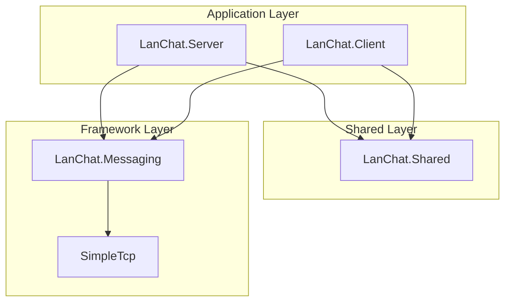

# System Architecture Specification (Đặc tả Kiến trúc Hệ thống)

## 1. Tổng quan hệ thống (System Overview)
Hệ thống Chat LAN được thiết kế theo mô hình **Client-Server** với kiến trúc phân tầng (Layered Architecture). Hệ thống áp dụng triệt để nguyên lý **Separation of Concerns** (Phân tách trách nhiệm), chia nhỏ ứng dụng thành các Module/Subsystem độc lập.

Cốt lõi của hệ thống dựa trên mô hình **Message-Driven** (Giao tiếp qua thông điệp), kết hợp với cơ chế **Length-Prefixed TCP Framing** để đảm bảo truyền tải dữ liệu an toàn, không bị phân mảnh.

---

## 2. Cấu trúc Solution (Directory Structure)

Dưới đây là cấu trúc mã nguồn thực tế, bao gồm các thành phần đã hoàn thiện (dựa trên ảnh chụp) và các dự án (Projects) sẽ được thêm vào để hoàn thiện hệ thống.

```text
📁 LANCHAT (Root Solution)
│
├── 📁 docs/                         # Tài liệu dự án
│   ├── 📄 03-messaging-mechanism.md # Đặc tả cơ chế Messaging
│   ├── 📄 04-use-cases-design.md    # Đặc tả Use Cases
│   └── 📄 01-system-architecture.md # Đặc tả kiến trúc (File này)
│
├── 📁 simple-tcp/                   # [Layer 1] Subsystem Transport (Đã có)
│   ├── 📁 Exceptions/               # Các lỗi liên quan đến kết nối và gói tin
│   ├── 📄 ISimpleTcpClient.cs       # Interface định nghĩa giao tiếp mạng
│   └── 📄 SimpleTcpClient.cs        # Triển khai TCP Framing (Big-Endian Length)
│
├── 📁 messaging/                    # [Layer 2] Subsystem Routing (Đã có)
│   ├── 📁 Exceptions/               
│   ├── 📄 IMessageHandler.cs        # Interface cho các Handler xử lý nghiệp vụ
│   ├── 📄 MessageDispatcher.cs      # Bộ định tuyến thông điệp dựa trên RoutingKey
│   ├── 📄 MessageEnvelope.cs        # Lớp vỏ bọc gói tin (RoutingKey + JsonElement)
│   └── 📄 SessionHandler.cs         # Vòng lặp quản lý một phiên kết nối TCP
│
├── 📁 shared/                       # [Layer 3] Shared Models (Chuẩn bị tạo)
│   └── 📄 LanChat.Shared.csproj     # Chứa DTOs, Routing Keys, Crypto Utils...
│
├── 📁 server/                       # [Layer 4] Server Application (Chuẩn bị tạo)
│   └── 📄 LanChat.Server.csproj     # Chứa Database Context, Server Handlers...
│
└── 📁 client/                       # [Layer 4] Client Application (Chuẩn bị tạo)
    └── 📄 LanChat.Client.csproj     # Chứa UI (WPF/WinForms), Client Handlers...
```

---

## 3. Chi tiết các Phân hệ (Subsystems & Modules)

### 3.1. Phân hệ Vận chuyển (`simple-tcp`)
- **Vai trò:** Là tầng thấp nhất, làm việc trực tiếp với `System.Net.Sockets`.
- **Nhiệm vụ:**
  - Thiết lập kết nối TCP.
  - Xử lý vấn đề TCP Stream Fragmentation (phân mảnh/dính gói tin) bằng cách đính kèm 4-bytes kích thước gói tin trước mỗi lần gửi.
  - Cung cấp các phương thức `async/await` để gửi/nhận mảng byte hoặc Object (JSON Serialization).
- **Nguyên tắc:** Hoàn toàn "mù" về nghiệp vụ. Không biết gói tin chứa gì, chỉ biết truyền bytes.

### 3.2. Phân hệ Định tuyến (`messaging`)
- **Vai trò:** Lớp trung gian, quản lý luồng dữ liệu thô và phân loại chúng.
- **Thành phần chính:**
  - `MessageEnvelope`: Lớp bọc mọi gói tin. Sử dụng `JsonElement` cho Payload để thực hiện Lazy-Parsing (chỉ giải mã khi cần).
  - `MessageDispatcher`: Trái tim của cơ chế định tuyến. Map các chuỗi `RoutingKey` tới các `IMessageHandler` tương ứng.
  - `SessionHandler`: Quản lý vòng lặp `while(true)` của một kết nối cụ thể, liên tục nhận tin và đẩy vào Dispatcher.

### 3.3. Phân hệ Dùng chung (`shared`) - *Shared Project*
- **Vai trò:** Định nghĩa "Ngôn ngữ chung" để Client và Server có thể giao tiếp mà không bị lỗi cấu trúc dữ liệu.
- **Nhiệm vụ:**
  - Chứa các hằng số `RoutingKeys` (vd: `const string AuthLogin = "auth.login";`).
  - Chứa các lớp **DTO (Data Transfer Objects)**: `LoginRequest`, `ChatMessagePayload`, `FileTransferMetadata`.
  - Chứa các tiện ích bảo mật độc lập: `AesCipher`, `RsaManager`.
- **Nguyên tắc:** Tuyệt đối không chứa logic giao diện (UI) hoặc logic truy xuất Database.

### 3.4. Ứng dụng Server (`server`)
- **Vai trò:** Trung tâm điều phối và lưu trữ dữ liệu vĩnh viễn.
- **Nhiệm vụ:**
  - Chứa `AppDbContext` (Entity Framework) để kết nối và truy vấn **Database** (Lưu tin nhắn, User, Nhóm chat).
  - Khởi tạo `TcpListener` lắng nghe kết nối.
  - Triển khai các `IMessageHandler` cho Server (vd: `ServerLoginHandler`, `ServerChatHandler`).
  - Quản lý trạng thái `OnlineUsers` trong RAM (ConcurrentDictionary).

### 3.5. Ứng dụng Client (`client`)
- **Vai trò:** Giao diện tương tác với người dùng cuối.
- **Nhiệm vụ:**
  - Cung cấp giao diện UI (Đăng nhập, Khung chat, Danh sách Online, Popup gửi file).
  - Triển khai các `IMessageHandler` để cập nhật UI khi có gói tin từ Server gửi về.
  - Quản lý trạng thái nội bộ (Local State) như khóa AES của phiên hiện tại.

---

## 4. Biểu đồ Phụ thuộc (Dependency Graph)

Để đảm bảo kiến trúc không bị dính lỗi tham chiếu vòng (Circular Dependency), các Project phải tuân thủ nghiêm ngặt chiều tham chiếu sau:



**Các quy tắc cấm kỵ (Anti-patterns):**
1. `LanChat.Shared` không được phép tham chiếu đến bất kỳ project nào.
2. `SimpleTcp` không được phép tham chiếu đến `LanChat.Messaging`.
3. `LanChat.Server` và `LanChat.Client` **TUYỆT ĐỐI KHÔNG** tham chiếu lẫn nhau.

---

## 5. Luồng xử lý dữ liệu tiêu chuẩn (Data Flow)

Để hiểu rõ sự phối hợp giữa các Project, đây là luồng đi của một tính năng (VD: Đăng nhập):

1. **Client (UI):** User nhập thông tin, UI tạo đối tượng `LoginRequest` (từ `Shared`), bọc vào `MessageEnvelope` và truyền cho `SessionHandler` (từ `Messaging`).
2. **Transport:** `SessionHandler` gọi `ISimpleTcpClient.SendObjectAsync` (từ `SimpleTcp`) để đẩy qua mạng LAN.
3. **Server Transport:** `ISimpleTcpClient` tại Server nhận bytes, gom lại, dịch thành `MessageEnvelope`.
4. **Server Routing:** `SessionHandler` tại Server truyền Envelope cho `MessageDispatcher`. Dispatcher đọc RoutingKey là `auth.login` và đẩy Payload vào `ServerLoginHandler`.
5. **Server Logic:** `ServerLoginHandler` giải mã Payload thành `LoginRequest`, gọi Database (Entity Framework), kiểm tra, và tạo `LoginResponse` gửi ngược lại cho Client.

--- 
*Tài liệu này đóng vai trò là kim chỉ nam cho toàn bộ quá trình lập trình. Mọi thay đổi về cấu trúc thư mục hoặc nguyên lý giao tiếp cần được cập nhật tại đây.*