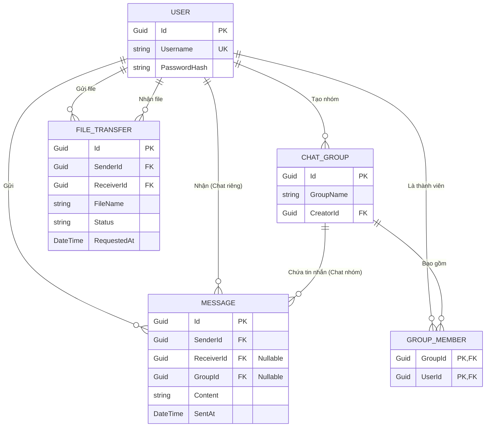

# Đặc tả Thiết kế Cơ sở dữ liệu (Database Entity Design)

## 1. Tổng quan & Triết lý thiết kế
Hệ thống lưu trữ của ứng dụng Chat LAN được thiết kế dựa trên nguyên lý **Minimalism (Tối giản)** và **Single Source of Truth (Nguồn chân lý duy nhất)**:
- **Dữ liệu bền vững (Persistent Data):** Các thông tin như Tài khoản, Lịch sử tin nhắn, Lịch sử truyền file được lưu vĩnh viễn vào Database thông qua Entity Framework Core.
- **Dữ liệu thời gian thực (Volatile Data):** Các trạng thái tạm thời như `IsOnline` hoặc `Session_Token` **KHÔNG** được lưu trong Database để tránh rác dữ liệu và giảm tải I/O. Trạng thái này được quản lý hoàn toàn trên RAM của Server (`ConcurrentDictionary`).

---

## 2. Sơ đồ Quan hệ Thực thể (ERD)

Sơ đồ dưới đây mô tả mối quan hệ giữa các thực thể trong hệ thống:

*(Chú thích: PK = Primary Key, FK = Foreign Key, UK = Unique Key)*

---

## 3. Đặc tả chi tiết các Thực thể (Entities)

Tất cả các ID trong hệ thống sử dụng kiểu `Guid` (UUID) để đảm bảo tính duy nhất, khó đoán và hỗ trợ tốt cho môi trường phân tán.

### 3.1. Entity: `User`
Lưu trữ thông tin định danh của người dùng.

| Tên Cột | Kiểu dữ liệu | Ràng buộc | Mô tả |
| :--- | :--- | :--- | :--- |
| `Id` | Guid | PK | Khóa chính. Tự động sinh `Guid.NewGuid()`. |
| `Username` | string | Required, Max(50), Unique | Tên đăng nhập. Không được trùng lặp. |
| `PasswordHash` | string | Required | Mật khẩu đã được băm (SHA-256 + Salt). Tuyệt đối không lưu plaintext. |

### 3.2. Entity: `ChatGroup`
Lưu trữ thông tin metadata của một phòng chat nhóm.

| Tên Cột | Kiểu dữ liệu | Ràng buộc | Mô tả |
| :--- | :--- | :--- | :--- |
| `Id` | Guid | PK | Khóa chính. |
| `GroupName` | string | Required, Max(100) | Tên hiển thị của nhóm chat. |
| `CreatorId` | Guid | Required, FK (`User.Id`) | ID của người dùng đã tạo ra nhóm này. |

### 3.3. Entity: `GroupMember`
Bảng trung gian thể hiện quan hệ Nhiều-Nhiều giữa Người dùng và Nhóm chat.

| Tên Cột | Kiểu dữ liệu | Ràng buộc | Mô tả |
| :--- | :--- | :--- | :--- |
| `GroupId` | Guid | PK, FK (`ChatGroup.Id`) | Khóa ngoại trỏ đến Nhóm. |
| `UserId` | Guid | PK, FK (`User.Id`) | Khóa ngoại trỏ đến Người dùng. |

*(Bảng này sử dụng Composite Key: Sự kết hợp giữa `GroupId` và `UserId` tạo thành khóa chính).*

### 3.4. Entity: `Message`
Lưu trữ toàn bộ nội dung tin nhắn. Bảng này dùng chung cho cả **Chat cá nhân** và **Chat nhóm** dựa trên việc cột nào bị NULL.

| Tên Cột | Kiểu dữ liệu | Ràng buộc | Mô tả |
| :--- | :--- | :--- | :--- |
| `Id` | Guid | PK | Khóa chính. |
| `SenderId` | Guid | Required, FK (`User.Id`) | ID người gửi tin nhắn. |
| `ReceiverId` | Guid? | Nullable, FK (`User.Id`) | ID người nhận. (Có giá trị nếu là Chat riêng). |
| `GroupId` | Guid? | Nullable, FK (`ChatGroup.Id`) | ID nhóm nhận. (Có giá trị nếu là Chat nhóm). |
| `Content` | string | Required | Nội dung tin nhắn (Hỗ trợ UTF-8 cho Emoji). |
| `SentAt` | DateTime | Required | Dấu thời gian hệ thống Server lúc nhận tin. |

*Lưu ý logic nghiệp vụ:* Cột `ReceiverId` và `GroupId` mang tính loại trừ lẫn nhau (Mutually Exclusive). Một tin nhắn không thể vừa gửi cho 1 cá nhân vừa gửi cho 1 nhóm.

### 3.5. Entity: `FileTransfer`
Lưu trữ lịch sử và trạng thái của các phiên truyền file. Không lưu mảng byte nội dung file vào Database.

| Tên Cột | Kiểu dữ liệu | Ràng buộc | Mô tả |
| :--- | :--- | :--- | :--- |
| `Id` | Guid | PK | Khóa chính (Cũng dùng làm `FileTransferID` định tuyến). |
| `SenderId` | Guid | Required, FK (`User.Id`) | ID người gửi file. |
| `ReceiverId` | Guid | Required, FK (`User.Id`) | ID người nhận file. |
| `FileName` | string | Required | Tên file và phần mở rộng (Vd: `tailieu.pdf`). |
| `Status` | string | Required | Trạng thái: `"Pending"`, `"Completed"`, `"Rejected"`, `"Failed"`. |
| `RequestedAt`| DateTime | Required | Thời điểm bắt đầu yêu cầu gửi file. |

---

## 4. Các Ràng buộc Dữ liệu (Database Constraints)

Các ràng buộc này được cấu hình bằng Fluent API trong lớp `AppDbContext` (Entity Framework Core) để bảo vệ tính toàn vẹn của dữ liệu ở mức Database:

1. **Ràng buộc Unique (Duy nhất):**
   - Trường `Username` trong bảng `Users` được lập chỉ mục `IsUnique()`. Cơ sở dữ liệu sẽ ném ra lỗi nếu có hành vi cố tình chèn 2 user trùng tên.
2. **Khóa chính kép (Composite Primary Key):**
   - Bảng `GroupMembers` sử dụng `HasKey(gm => new { gm.GroupId, gm.UserId })`. Đảm bảo một User không thể được thêm vào cùng một Group 2 lần.

---

## 5. Kiến trúc Quản lý Trạng thái Online (Non-Database State)

Để bù đắp cho việc loại bỏ cột `IsOnline` khỏi bảng `Users`, hệ thống áp dụng cơ chế quản lý trạng thái in-memory:

- **Thành phần:** Lớp `SessionManager` (được đăng ký dạng Singleton trong Server App).
- **Cấu trúc dữ liệu:** `ConcurrentDictionary<string, SessionHandler>`
  - `Key`: Username (chuỗi).
  - `Value`: Đối tượng `SessionHandler` (chứa kết nối TCP socket thực tế).
- **Hành vi:**
  - Khi User Login thành công: Thêm vào Dictionary.
  - Khi Socket ngắt kết nối (mất mạng/logout): Xóa khỏi Dictionary.
- **Ưu điểm:** Độ trễ O(1), không tốn I/O của Database, trạng thái phản ánh chính xác 100% kết nối vật lý.