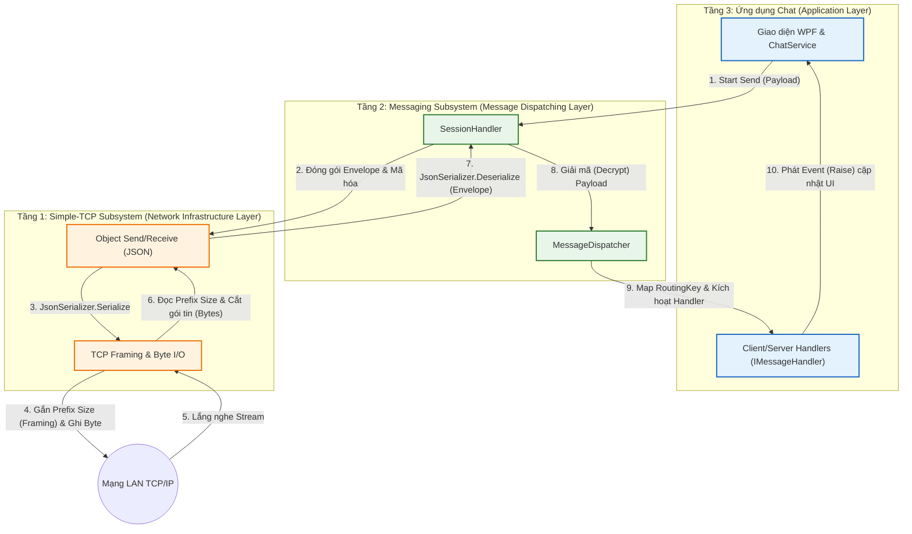

# CHƯƠNG 2: KIẾN TRÚC TỔNG QUAN (LAYERED ARCHITECTURE)

## 2.1 Mô hình kiến trúc phân tầng

Trong quá trình thiết kế và phát triển các hệ thống mạng phân tán, việc lựa chọn một kiến trúc nền tảng phù hợp đóng vai trò tiên quyết nhằm đảm bảo tính ổn định, dễ bảo trì và khả năng mở rộng của phần mềm. Đối với dự án Chat LAN, mô hình Kiến trúc Phân tầng (Layered Architecture) đã được lựa chọn làm kim chỉ nam cho toàn bộ quá trình thiết kế hệ thống. 

Nguyên lý cốt lõi của việc áp dụng mô hình phân tầng trong dự án là sự chia tách rõ ràng và triệt để giữa tầng xử lý mạng lõi (Core Network) và tầng xử lý nghiệp vụ ứng dụng (Business Logic). 

Truyền thông qua socket ở mức thấp (low-level socket) tiềm ẩn rất nhiều phức tạp về mặt quản lý luồng dữ liệu (byte stream), xử lý các mảnh vỡ của gói tin (packet fragmentation) và đảm bảo tính toàn vẹn của dữ liệu (framing). Nếu các thành phần xử lý I/O mạng này được viết lồng ghép trực tiếp với các xử lý luồng nghiệp vụ (như xác thực người dùng, lưu trữ tin nhắn hay quản lý phiên chat), mã nguồn sẽ rơi vào tình trạng kết dính cao (tight coupling). Hậu quả là việc gỡ lỗi (debug) và bảo trì sẽ trở nên cực kỳ khó khăn, đồng thời mọi sự thay đổi nhỏ ở cơ chế mạng đều có thể dẫn đến sự sụp đổ của logic ứng dụng.

Bằng cách sử dụng Kiến trúc phân tầng, dự án đã giải quyết bài toán này thông qua sự phân rã hệ thống thành các lớp (layers) phân cấp. Mỗi tầng sẽ chỉ chịu trách nhiệm cho một nhóm công việc chuyên biệt và giao tiếp với nhau thông qua những giao diện (interfaces) hoặc chuẩn khế ước dữ liệu (data contracts) đã được định nghĩa sẵn. Tầng dưới che giấu đi sự phức tạp của cơ chế vật lý để cung cấp dịch vụ cho tầng trên, trong khi tầng trên tập trung hoàn toàn vào việc triển khai quy tắc nghiệp vụ. Điều này cũng giúp các module mạng như Simple-TCP hay Messaging Subsystem hoàn toàn có thể được tái sử dụng nguyên vẹn trong các hệ thống phần mềm khác mà không cần chỉnh sửa mã nguồn cốt lõi.

## 2.2 Sơ đồ kiến trúc tổng thể

Kiến trúc hệ thống được chia làm 3 phân hệ chính, thiết lập thành một chuỗi phụ thuộc tuyến tính từ trên xuống: **Ứng dụng Chat** $\rightarrow$ **Messaging Subsystem** $\rightarrow$ **Simple-TCP Subsystem**.

Sơ đồ khối dưới đây mô tả định dạng luồng thông tin và cấu trúc phụ thuộc của các tầng trong hệ thống:

**Mô tả các thành phần trong sơ đồ kiến trúc:**

1. **Tầng 1 - Hạ tầng mạng (Simple-TCP Subsystem):** Tương tác trực tiếp với Network Stream, xử lý hoàn toàn các thao tác với TCP Socket. Tầng này chịu trách nhiệm đóng khung dữ liệu (framing) để tránh việc dính hoặc vỡ gói tin (TCP stream fragmentation).
2. **Tầng 2 - Điều phối tin nhắn (Messaging Subsystem):** Đóng vai trò làm lớp trung gian (middleware). Nhận chuỗi byte toàn vẹn từ tầng Simple-TCP, giải mã (Deserialize) thành các đối tượng chuẩn `Message Envelope`. Tầng này cũng đảm nhận vai trò phân tích `Header` của tin nhắn và chuyển hướng (Dispatch) dữ liệu tĩnh đến các bộ phận xử lý tương ứng.
3. **Tầng 3 - Ứng dụng Chat (Application Layer):** Nơi chứa UI và thực thi luật nghiệp vụ (Business Logic). Tầng này không quan tâm đến dữ liệu mạng được gửi hoặc nhận thông qua giao thức nào. Các Handler tại đây chỉ việc tiếp nhận các đối tượng dữ liệu cụ thể, xử lý logic (như lưu Chat, xác thực đăng nhập) và trả về kết quả cho trình chiếu UI.
