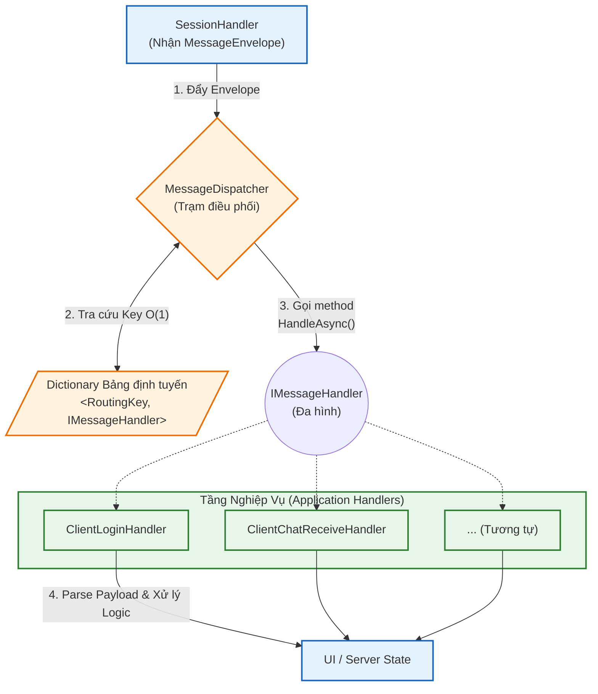

# CHƯƠNG 3: THIẾT KẾ VÀ TRIỂN KHAI CÁC HỆ THỐNG CON (SUBSYSTEMS)

Như đã phân tích ở kiến trúc phân tầng, thành công của hệ thống Chat đa luồng phụ thuộc lớn vào việc chia tách các trách nhiệm kỹ thuật thành các hệ thống con (subsystem) độc lập. Chương này sẽ trình bày chi tiết về thiết kế của hai hệ thống con cốt lõi: Simple-TCP (xử lý byte và socket) và Messaging (xử lý định tuyến thông điệp), theo tiến trình đi từ nguyên do ra đời (Tại sao), khái niệm định hình (Cái gì), cho đến phương pháp triển khai thực tế (Như thế nào).

## 3.1 Hệ thống con Simple-TCP (Tầng hạ tầng mạng)

### 3.1.1 Nguyên nhân ra đời (Tại sao?)

Giao thức TCP (Transmission Control Protocol) đảm bảo độ tin cậy trong việc truyền dữ liệu nhờ cơ chế bắt tay 3 bước và kiểm tra lỗi, nhưng lại tiềm ẩn một đặc trưng phức tạp: luồng dữ liệu (byte stream) không có biên giới tự nhiên. Khi máy gửi phát đi hai gói tin riêng biệt, máy tính nhận có thể nhận về cả hai gói tin bị "dính" vào nhau (TCP Sticky Packets) hoặc nhận về một gói tin bị cắt vụn (Fragmentation). 

Bên cạnh đó, trong các mô hình lập trình mạng truyền thống, cấu trúc byte của gói tin thường bị định dạng cứng nhắc cho từng tính năng biệt lập. Chẳng hạn, tín hiệu "nhắn tin" đơn thuần có thể chỉ cần 4 byte kích thước chèn trước nội dung; nhưng tín hiệu "đăng nhập" lại đòi hỏi 4 byte kích thước chuẩn, 4 byte độ dài tên đăng nhập, N byte dữ liệu tên đăng nhập, và N byte còn lại là mật khẩu. Sự thiếu đồng nhất này buộc bộ phận xử lý ứng dụng phải liên tục trích xuất và ép kiểu mảng byte theo cách thủ công. Việc phải "cân đo đong đếm" cách pack/unpack từng byte khiến hệ thống bị phân mảnh, dễ dính lỗi lệch offset, và gần như không thể mở rộng bảo trì.

Nếu ứng dụng tầng trên phải liên tục loay hoay giải định dạng cấu trúc byte tùy biến và bài toán "câu chữ bị ngắt khúc" từ tập Raw Socket, mã nguồn sẽ trở nên vô cùng hỗn loạn. Do đó, sự ra đời của một lớp nền tảng chuẩn hóa cấu trúc gói tin duy nhất là điều kiện tiên quyết để cách ly hoàn toàn sự phức tạp của I/O mạng.

### 3.1.2 Định nghĩa hệ thống (Cái gì?)

Simple-TCP Subsystem là một thư viện bọc (wrapper library) được phát triển độc lập, quản lý trực tiếp thư viện `System.Net.Sockets.Socket`. Hệ thống cung cấp các giao diện lập trình bậc cao (High-level API) như `SendObjectAsync<T>` hoặc `ReceiveObjectAsync<T>`.

Nhờ đó, thay vì phải tính toán con trỏ mảng byte, tầng ứng dụng chỉ cần giao tiếp bằng các khái niệm hướng đối tượng. Simple-TCP sẽ tự động nhận lãnh trách nhiệm chuyển đổi hình thái dữ liệu và bảo toàn kích thước nguyên bản của thông số I/O mạng.

### 3.1.3 Phương thức triển khai (Như thế nào?)

Để hoàn thành nhiệm vụ cầu nối, Simple-TCP thực thi hai tiến trình kỹ thuật cốt lõi:

**1. Cơ chế đóng khung dữ liệu (Packet Framing)**

Để giải quyết vấn đề nhận diện dính/vỡ gói tin, Simple-TCP áp dụng kỹ thuật **Length-Prefix Framing**. Mỗi thông điệp khi được gửi đi sẽ được thiết kế thành một "Gói tin ảo" (Virtual Packet) gồm 2 phần: `Header` và `Payload`.

*   **Header (4 bytes):** Là cụm số nguyên kiểu `Int32` lưu kích thước của Payload.
*   **Payload (N bytes):** Dữ liệu thực tế.

Khi tiến hành đọc từ Stream (phương thức `ReceiveAsync`), hệ thống sẽ:
- Luôn luôn đọc chính xác 4 byte đầu tiên để xác định `Message Size` (kích thước chuỗi nội dung). Có tính toán đổi chiều Little Endian sang dạng chuẩn nếu cần thiết.
- Sau đó, hệ thống tiếp tục đọc đúng số lượng byte như đã thông báo trong Header. Quá trình này sẽ chạy trong một vòng lặp (buffer loop) cho đến khi gom đủ lượng dữ liệu yêu cầu, đảm bảo luồng tin nhận ở máy đích nguyên vẹn 100% so với khi xuất phát.

**2. Tuần tự hóa và phục hồi đối tượng (Serialization/Deserialization)**

Song song với việc quản lý mảng byte, hệ thống tích hợp thư viện `System.Text.Json` để tự động hóa việt dịch dịch. Khi ứng dụng gọi `SendObjectAsync(obj)`:
- System sẽ mã hóa (Serialize) Object đó thành chuỗi văn bản chuẩn JSON.
- Đổi văn bản JSON qua tập mảng byte chuẩn UTF-8.
- Nạp khối mảng byte này làm Payload, đóng gói với Length-Prefix và truyền vào Network Stream.
Quá trình diễn ra tương tự theo chiều ngược lại cho I/O nhận dữ liệu.

## 3.2 Hệ thống con Messaging (Tầng điều phối tin nhắn)

### 3.2.1 Nguyên nhân ra đời (Tại sao?)

Sau khi Simple-TCP đã bóc tách dữ liệu rác và trả về các Entity Object nguyên vẹn, hệ thống tiếp tục đối mặt với bài toán thứ hai: *Định hình và điều phối*. Hệ thống có hàng chục chức năng riêng rẽ (như Nhắn tin, Yêu cầu gửi file, Xác thực...). Nếu toàn bộ logic xử lý tập trung lại bằng những câu lệnh rẻ nhánh `if/else` hoặc `switch/case` khổng lồ, phần mềm sẽ triệt tiêu khả năng mở rộng (vi phạm nguyên tắc Open/Closed). 

### 3.2.2 Định nghĩa hệ thống (Cái gì?)

Messaging Subsystem là tầng trung gian điều phối logic, được thiết kế theo mẫu kiến trúc **Message Dispatcher Pattern**. Nó chuyển hóa mạng lưới giao tiếp hỗn độn thành một trạm thu nhận thông điệp duy nhất (Entry Point). Tại trạm thu phát này, dữ liệu sẽ được phân loại tuần tự và bẻ ghi (route) tới đúng các "bộ xử lý nghiệp vụ" (Handlers) chịu trách nhiệm thi hành mà không làm tắc nghẽn luồng xử lý chính.

Dưới đây là sơ đồ trực quan hóa luồng hoạt động của Message Dispatcher Pattern được triển khai trong hệ thống:

### 3.2.3 Phương thức triển khai (Như thế nào?)

Quá trình "nhận diện" và "bẻ ghi" được cụ thể hóa bằng hai đối tượng lập trình nền tảng: `MessageEnvelope` và hệ thống phân phối `MessageDispatcher`.

**1. Chuẩn hóa bằng kiện hàng dữ liệu (Message Envelope)**

Nhằm tạo ra một nguyên bản chung giúp Dispatcher đọc hiểu mọi gói tin, mọi thực thể truyền trong hệ thống đều được bọc trong một đối tượng vỏ bọc (`MessageEnvelope`). Cấu trúc Envelope bao gồm:
- **RoutingKey:** Một đoạn Text ngắn (ví dụ: `auth.login`, `chat.msg`) miêu tả trực diện mục tiêu xử lý của kiện hàng.
- **Payload:** Nội dung dữ liệu tùy biến (Tùy thuộc vào RoutingKey, có thể mang khuôn dạng của Request Đăng nhập hoặc Request Gửi file). Vì được lưu dưới dạng `JsonElement`, Payload chỉ được phân tích cú pháp tĩnh khi Handler phù hợp yêu cầu lấy ra sử dụng.

**2. Cơ chế phân phối (Dispatcher) trong thời gian O(1)**

Cốt lõi của điều phối thông minh nằm ở class `MessageDispatcher`. 
- Tại thời điểm khởi động ứng dụng, toàn bộ các luồng xử lý (kế thừa từ Interface `IMessageHandler`) đều phải tự trình diện và khai báo `RoutingKey` mà chúng phụ trách vào trong một cấu trúc dò tìm (cụ thể là `Dictionary<string, IMessageHandler>`).
- Khi một đối tượng `MessageEnvelope` mới trôi lên từ Simple-TCP, `SessionHandler` sẽ chuyển nó sang `MessageDispatcher`.
- Dispatcher chỉ việc lấy `RoutingKey` từ bưu kiện để tra cứu ngay lập tức Handler quản lý bên trong từ điển Hash. Hệ thống ngay lập tức gọi method `HandleAsync()` của Handler đó và cấp quyền điều khiển cho nó.

Cách tiếp cận **Plug and Play** này giải phóng hoàn toàn sự phục thuộc giữa các luồng logic. Để thêm tính năng Gọi Video hay Truyền File mới, kỹ sư phần mềm hoàn toàn không cần can thiệp dỡ bỏ cấu trúc code cũ, mà chỉ việc viết file lớp Handler mới và thêm vào hàm đăng ký của Dispatcher. I/O luồng I/O mạng vẫn hoạt động độc lập và trơn tru.