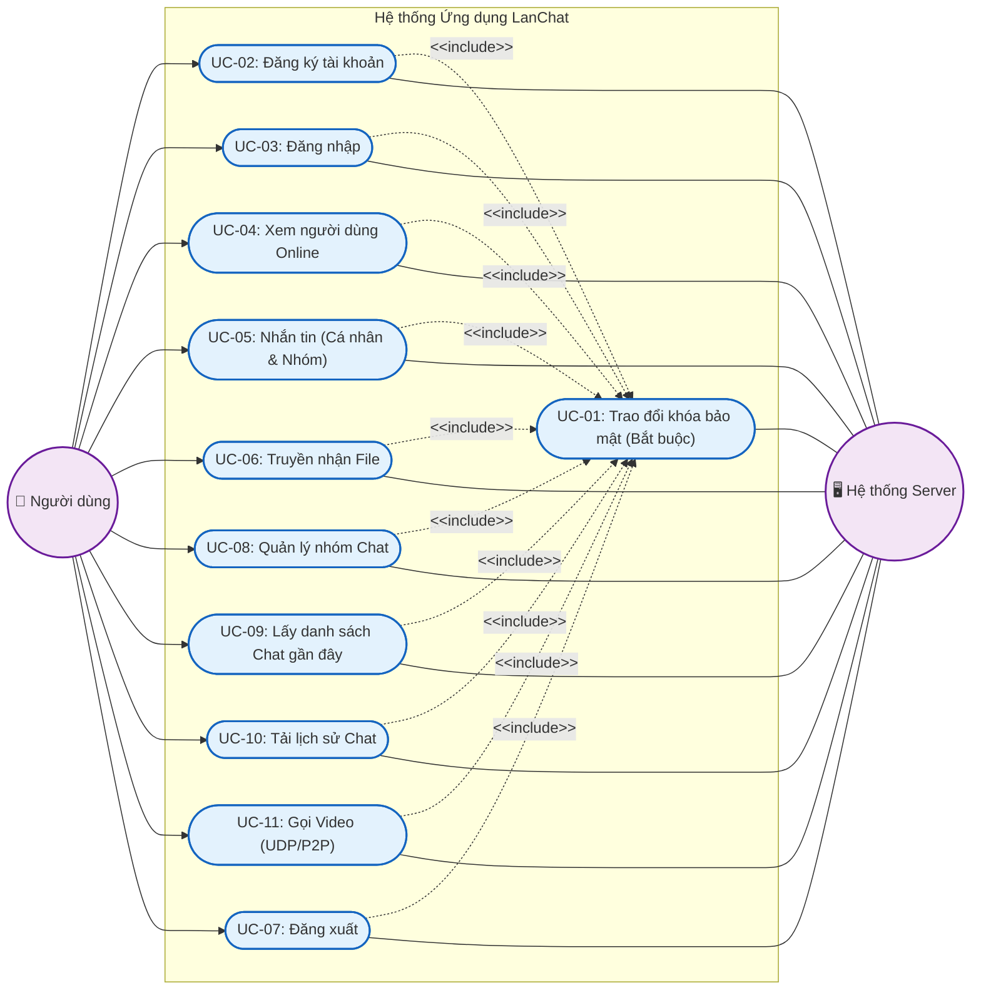
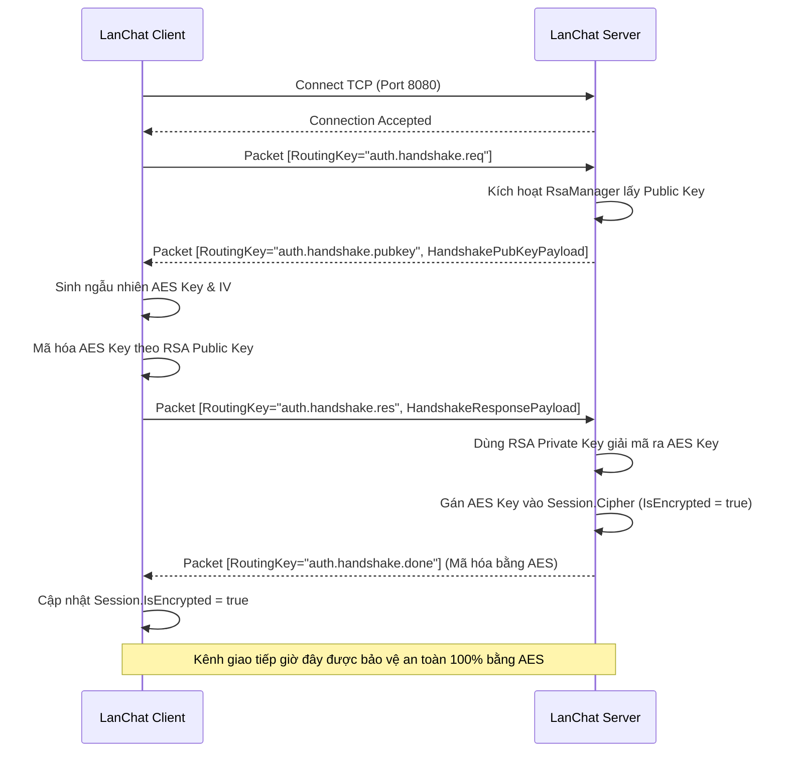
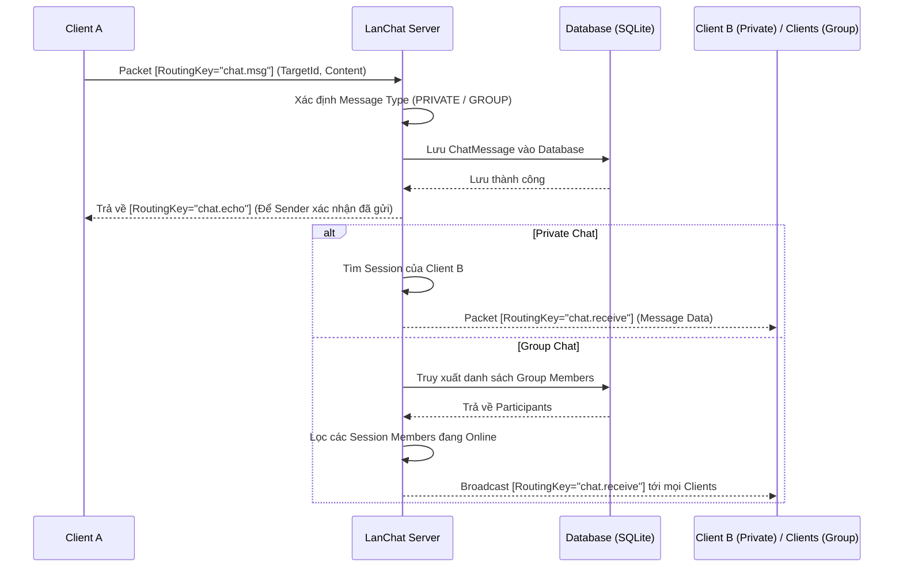
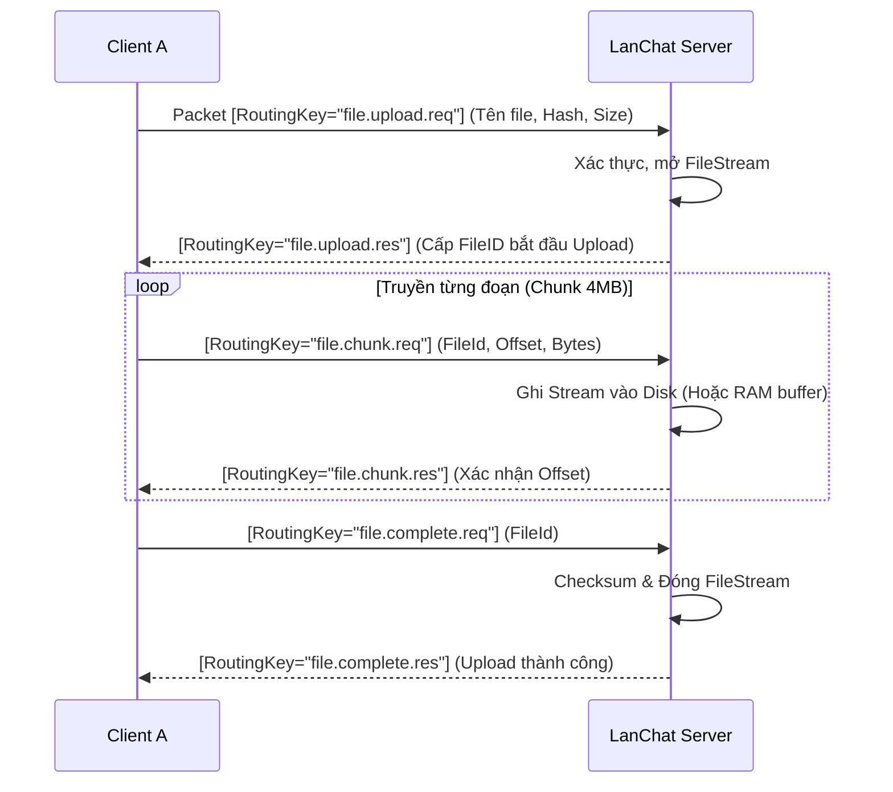
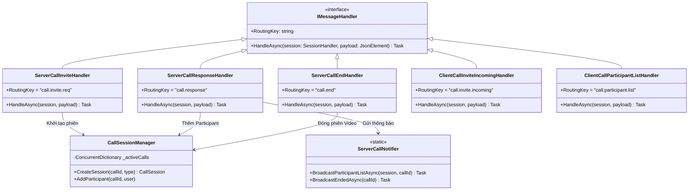

# CHƯƠNG 4: THIẾT KẾ CHI TIẾT ỨNG DỤNG

## 4.1 Biểu đồ Use Case tổng thể của ứng dụng

Dựa trên các yêu cầu chức năng đã đề ra, hệ thống LanChat được thiết kế để phục vụ các tương tác nghiệp vụ thời gian thực của người dùng (End-User) trong một mạng cục bộ (LAN). Sơ đồ Usecase dưới đây tổng hợp toàn bộ các hành vi mà ứng dụng cung cấp, được quản lý phi tập trung qua sự điều phối của Server.



## 4.2 Chi tiết các Use Case và Biểu đồ tuần tự (Sequence Diagram)

Do khối lượng Use Case của hệ thống là tương đối lớn, báo cáo này sẽ đi sâu phân tích thiết kế giao tiếp của các nghiệp vụ quan trọng nhất mang tính đại diện cho các phương thức khác nhau: Cơ chế bảo mật (UC-01), Nhắn tin (UC-05), Truyền tải file (UC-06) và Streaming Đa phương tiện qua Peer-to-Peer (UC-11).

### 4.2.1 Trao đổi khóa bảo mật (UC-01: Secure Handshake)

**1. Mô tả chi tiết**
Handshake được tự động kích hoạt ngay khi Client kết nối TCP thành công đến Server, thiết lập một kênh truyền mã hóa AES.
*   Server sẽ giữ vòng đời phân phối RSA Key (`RsaManager`).
*   Client tự sinh ngẫu nhiên AES Key + IV, mã hóa nó bằng RSA Public Key của Server và gửi lên. 
*   Kể từ sau bước này, mọi gói tin được gửi đi đều được mã hóa bằng thuật toán đối xứng AES.

**2. Biểu đồ tuần tự**


---

### 4.2.2 Giao tiếp tin nhắn (UC-05: Send Message)

**1. Mô tả chi tiết**
Cho phép gửi tin nhắn văn bản giữa 2 cá nhân (Private) hoặc một hội thoại nhóm (Group). Cấu trúc của Message Dispatcher sẽ điều hướng gói tin vào class `ServerChatMsgHandler` trên Server. Server sẽ đóng vai trò như một Relay: định tuyến gói tin từ người gửi và gửi lại trực tiếp vào Session của danh sách người nhận (sau khi đã lưu trữ vào CSDL).

**2. Biểu đồ tuần tự**


---

### 4.2.3 Truyền tải tập tin (UC-06: File Transfer)

**1. Mô tả chi tiết**
Truyền file trong LanChat sử dụng cơ chế chia nhỏ luồng byte (Chunking) để tránh việc tắc nghẽn bộ nhớ của TCP Stream. 
*   Người gửi phát tín hiệu Upload. Server sẽ mở File Stream tạm thời để ghi từ từ từng Chunk 4MB.
*   Sau khi Server ghi thành công, Server phát tín hiệu cho người nhận đến lấy (Download). Người nhận tiến hành request lần lượt các Chunk từ Server cho đến khi file hoàn chỉnh.

**2. Biểu đồ tuần tự (Quá trình Upload)**


---

### 4.2.4 Cuộc gọi Video Đa phương tiện qua P2P (UC-11: Video Call)

**1. Mô tả chi tiết**
Tính năng Video Call đánh dấu bước tiến chuyển dịch trạng thái mạng. `TCP port 8080` (đi qua Dispatcher như bình thường) tiếp tục được sử dụng làm vòng điều khiển thông số liên lạc (Signaling Channel). Tuy nhiên, để đáp ứng được độ trễ thời gian thực cho Audio/Video, ứng dụng sẽ khởi động một luồng `UDP Media Plane` độc lập. Server không nhận hay định tuyến bất kỳ file phương tiện nào, mạng luân chuyển dạng lưới P2P (Mesh) hoàn toàn do Client tự quản.

*   **Tạo Gọi (Invitation):** `ServerCallInviteHandler` lọc số người online, quản lý Phiên (SessionManager) lưu vào RAM và phát lời mời bằng TCP.
*   **Phản hồi (Response):** Các Client B trả về `ServerCallResponseHandler` (Accept/Reject). Cập nhật UDP Port cho nhau.
*   **Tham gia (P2P):** Kích hoạt `ClientCallParticipantListHandler` để báo cho Client A biết IP và Port UDP ảo của các thành viên. Video Frame truyền trực diện từ màn hình máy A qua máy B mà không thông qua Server (tối giản latency).

**2. Thiết kế lớp chi tiết (Class Design)**



**3. Biểu đồ tuần tự (Sequence Diagram)**

```mermaid
sequenceDiagram
    participant Caller as Caller (Client A)
    participant Server TCP as Server (Signaling)
    participant Callee as Callee (Client B/Group)

    %% GDD 1
    rect rgb(200, 220, 240)
    note right of Caller: 1. Khởi tạo & Signaling qua TCP
    Caller->>Server TCP: [RoutingKey="call.invite.req"] (TargetId, UdpPort)
    Server TCP->>Caller: [RoutingKey="call.invite.created"] 
    Server TCP->>Callee: [RoutingKey="call.invite.incoming"] (CallId, CallerInfo)
    end

    %% GD 2
    rect rgb(200, 240, 200)
    note right of Callee: 2. Phản hồi và đàm phán UDP Port
    alt Callee CHẤP NHẬN Cuộc gọi (Accept)
        Callee->>Server TCP: [RoutingKey="call.response"] (CallId, Accept=true, UdpPort)
        Server TCP->>Caller: [RoutingKey="call.participant.list"] (Kèm IP & UDP Port)
        Server TCP->>Callee: [RoutingKey="call.participant.list"] (Kèm IP & UDP Port)
        note over Caller, Callee: 3. Media Plane: Mesh P2P UDP Streaming
        Caller<-->>Callee: Gửi Trực Tiếp Video/Audio Frame qua UDP (Không qua Server)
    else Callee TỪ CHỐI Cuộc gọi (Reject)
        Callee->>Server TCP: [RoutingKey="call.response"] (CallId, Accept=false)
        Server TCP->>Caller: [RoutingKey="call.ended"] (Reason="Rejected")
    end
    end

    %% GD 3
    rect rgb(240, 200, 200)
    note right of Caller: 4. Kết thúc & Đóng phiên Video
    Caller->>Server TCP: [RoutingKey="call.end"] (CallId)
    Server TCP->>Server TCP: Xóa CallSessionManager
    Server TCP->>Callee: [RoutingKey="call.ended"] (Đóng cửa sổ Video)
    end
```