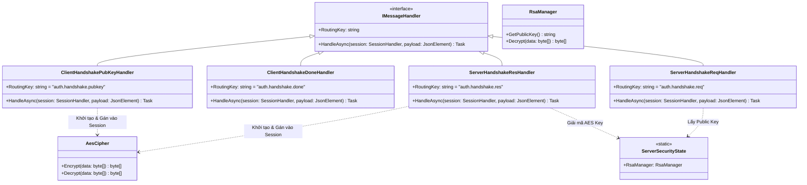
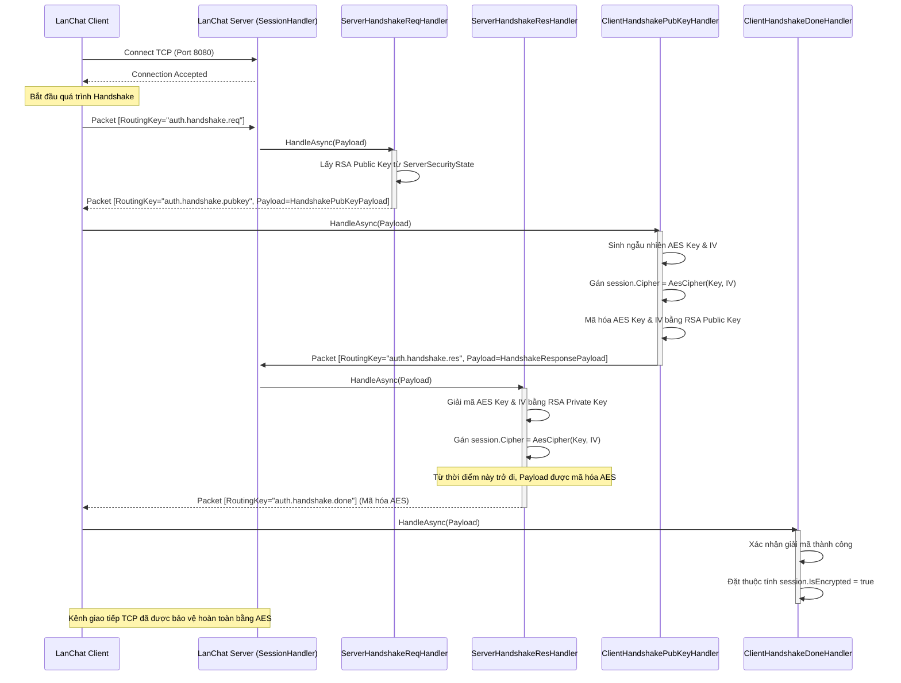

# Báo cáo triển khai Use Case: UC-01 Secure Handshake

## 1. Mô tả chi tiết
Use case **Secure Handshake (Trao đổi khóa bảo mật)** được tự động kích hoạt ngay khi Client thiết lập kết nối TCP thành công đến Server. Quá trình này thiết lập một kênh truyền an toàn, mã hóa bằng thuật toán AES. 
Quá trình triển khai thực tế tuân thủ nghiêm ngặt thiết kế ban đầu:
- Server quản lý vòng đời RSA Key (`RsaManager`).
- Client sinh ngẫu nhiên AES Key và IV, sử dụng RSA Public Key của Server để mã hóa và gửi lại.
- Sau khi trao đổi thành công, thuộc tính `Cipher` của `SessionHandler` được gán để tự động mã hóa mọi dữ liệu `Payload` tiếp theo.

## 2. Thiết kế lớp chi tiết (Class Design)
Dưới đây là sơ đồ lớp chi tiết thể hiện các thành phần tham gia vào luồng Handshake:

## 3. Biểu đồ tuần tự (Sequence Diagram)
Biểu đồ tuần tự chi tiết mô tả quá trình trao đổi khóa và chuyển trạng thái của Session sang đã mã hóa (IsEncrypted = true).

