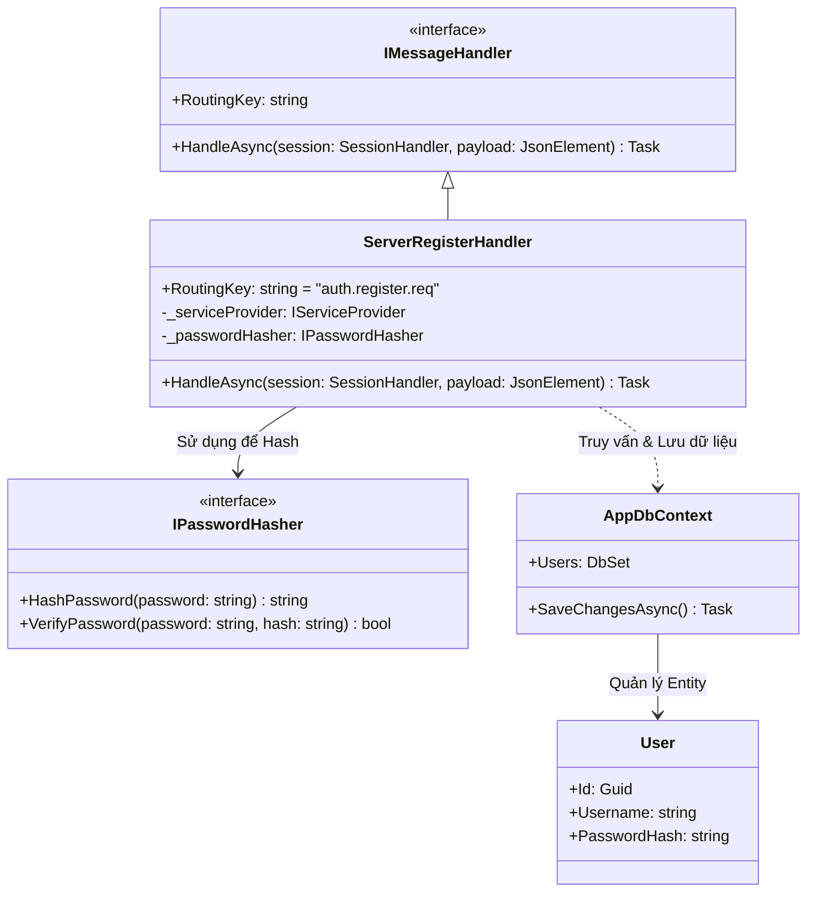
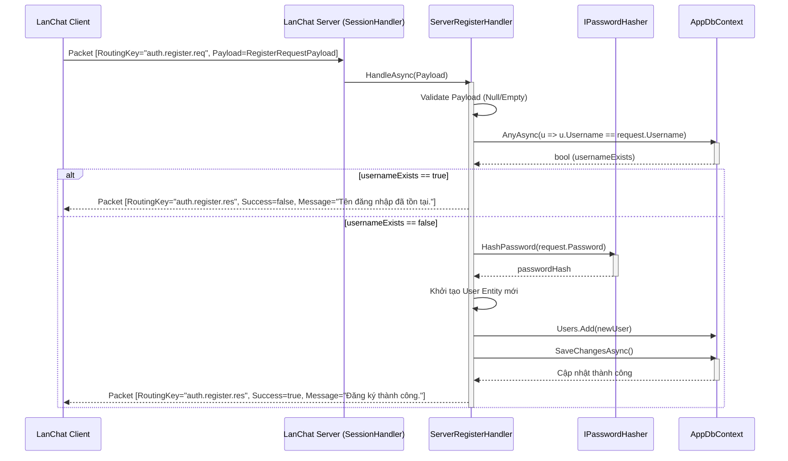

# Báo cáo triển khai Use Case: UC-02 User Registration

## 1. Mô tả chi tiết
Use case **User Registration (Đăng ký tài khoản)** cho phép người dùng mới đăng ký một tài khoản trên hệ thống LanChat.
Dữ liệu người dùng được lưu trữ lâu dài bằng Entity Framework Core (chứa trong `AppDbContext`). Để đảm bảo an toàn, hệ thống không lưu mật khẩu dạng plaintext mà tiến hành hash mật khẩu thông qua interface `IPasswordHasher` (sử dụng thuật toán an toàn) trước khi ghi vào CSDL.

## 2. Thiết kế lớp chi tiết (Class Design)
Dưới đây là sơ đồ lớp chi tiết của quá trình đăng ký:

## 3. Biểu đồ tuần tự (Sequence Diagram)
Biểu đồ tuần tự dưới đây thể hiện luồng xử lý từ khi Client gửi yêu cầu đăng ký đến khi Server phản hồi.

