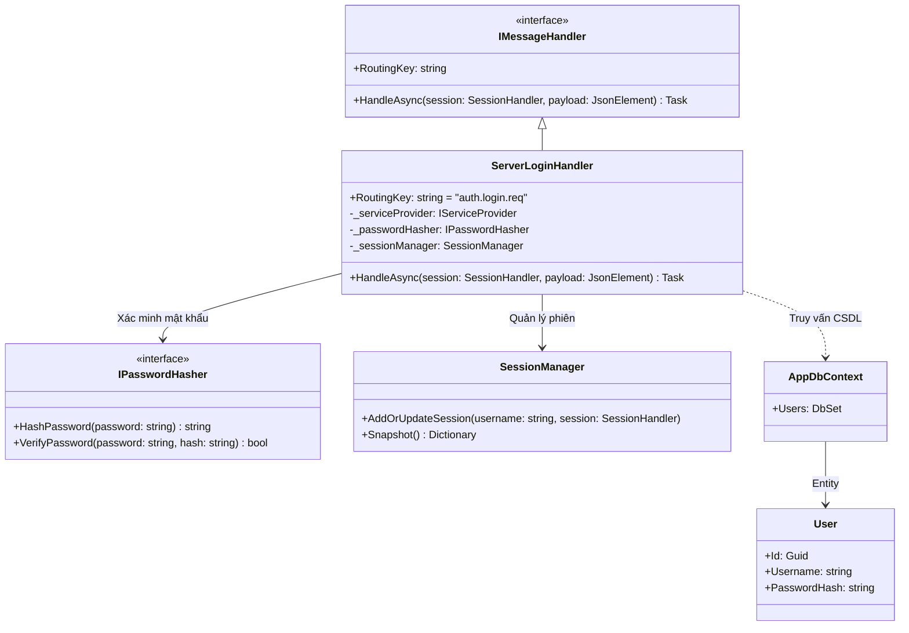
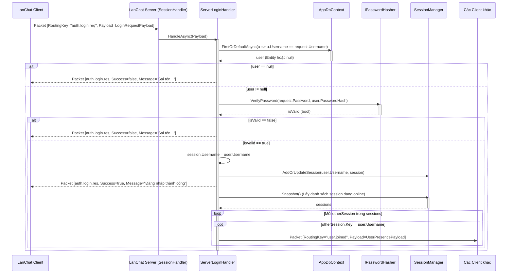

# Báo cáo triển khai Use Case: UC-03 User Login

## 1. Mô tả chi tiết
Use case **User Login (Đăng nhập)** cho phép người dùng xác thực và truy cập vào hệ thống.
Quá trình này kiểm tra thông tin trong CSDL qua `AppDbContext` và đối chiếu mật khẩu sử dụng `IPasswordHasher`.
Sau khi đăng nhập thành công, Server gán Username cho `SessionHandler` hiện tại, đăng ký session này với `SessionManager` để quản lý tập trung, trả về kết quả thành công và tiến hành broadcast `user.joined` cho các người dùng khác biết người này vừa online.

## 2. Thiết kế lớp chi tiết (Class Design)
Dưới đây là sơ đồ lớp chi tiết của quá trình đăng nhập:

## 3. Biểu đồ tuần tự (Sequence Diagram)
Biểu đồ tuần tự mô tả chi tiết các bước xác thực và phát sóng trạng thái online.

