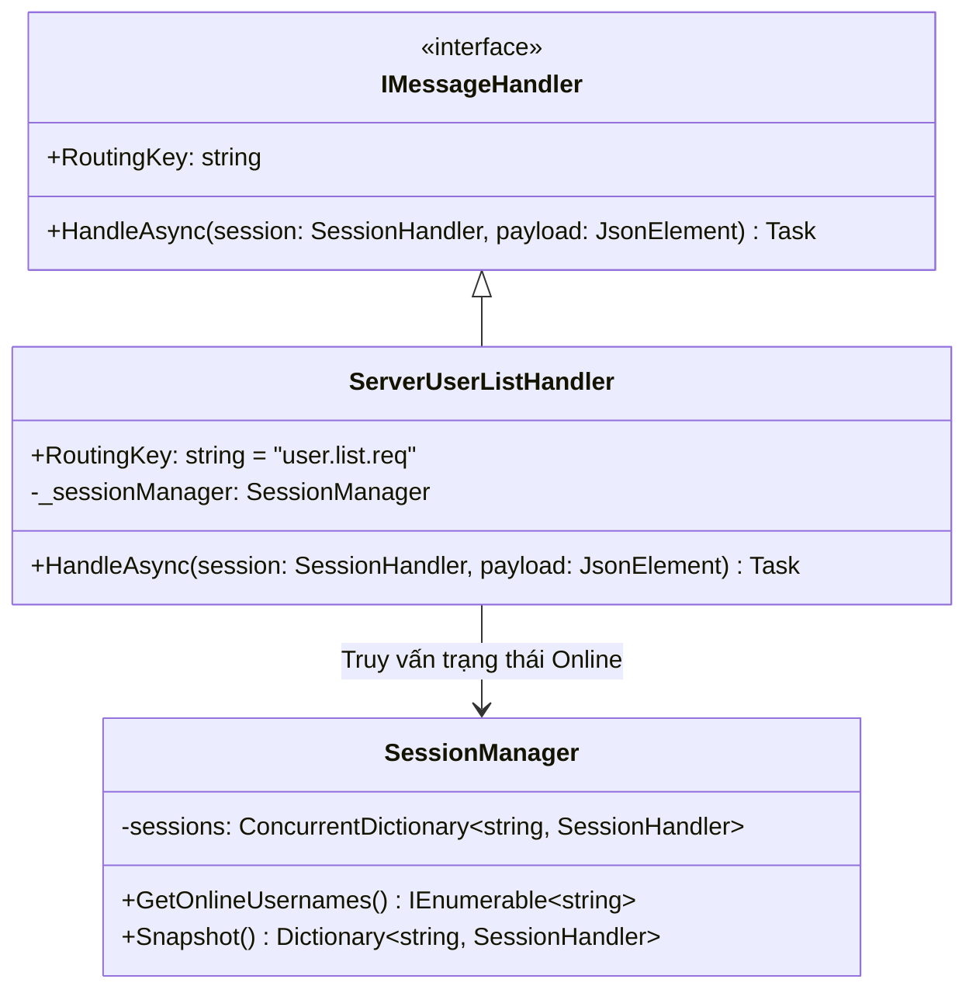
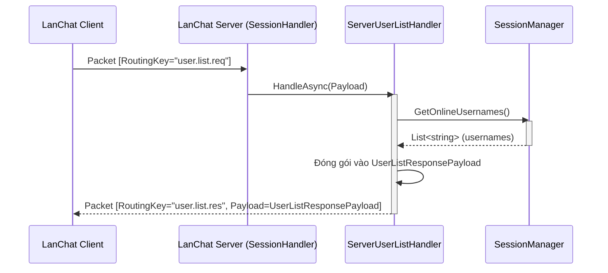

# Báo cáo triển khai Use Case: UC-04 Get Online Users

## 1. Mô tả chi tiết
Use case **Get Online Users (Lấy danh sách Online)** cung cấp danh sách những người dùng hiện đang hoạt động. 
Quá trình này được tối ưu hóa ở phía Server bằng cách không cần truy vấn vào CSDL. Thay vào đó, Server sử dụng `SessionManager` (Singleton) để lưu trữ và quản lý trực tiếp các kết nối TCP trong bộ nhớ (RAM) thông qua `ConcurrentDictionary`. Điều này giúp hệ thống trả về kết quả cực kỳ nhanh chóng.

## 2. Thiết kế lớp chi tiết (Class Design)
Dưới đây là sơ đồ lớp chi tiết của quá trình lấy danh sách người dùng online:

## 3. Biểu đồ tuần tự (Sequence Diagram)
Biểu đồ tuần tự mô tả các bước Client gửi yêu cầu và Server phản hồi từ bộ nhớ đệm (RAM).

