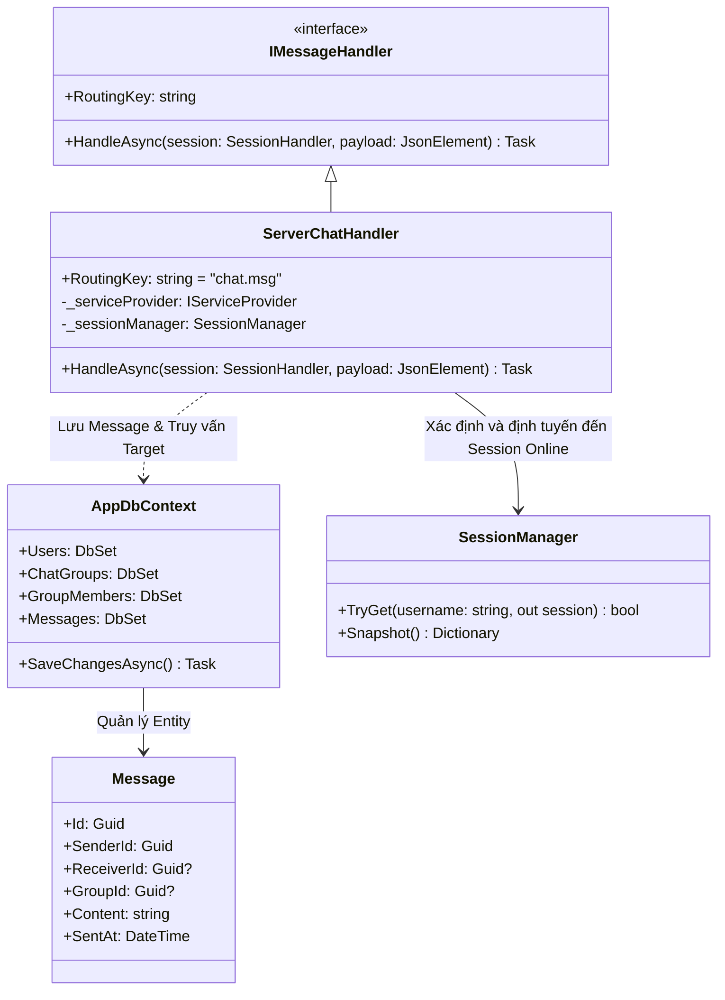
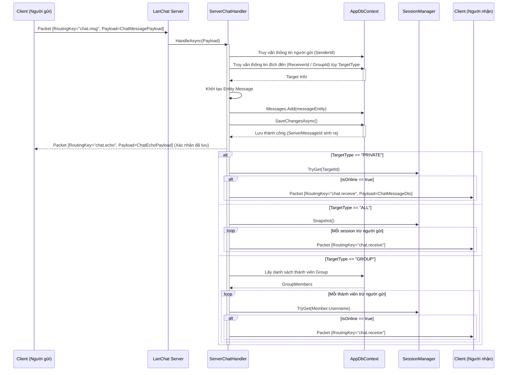

# Báo cáo triển khai Use Case: UC-05 Send Message

## 1. Mô tả chi tiết
Use case **Send Message (Chat cá nhân/Nhóm/Toàn mạng)** phụ trách việc nhận tin nhắn từ Client, lưu trữ vào CSDL để bảo toàn dữ liệu và định tuyến (Routing) gói tin đến người nhận phù hợp dựa vào `TargetType`.
Server luôn **ghi tin nhắn vào Database (Entity Framework)** trước khi phân phối, điều này đảm bảo tính nhất quán (Consistency) kể cả khi người nhận hiện không Online (họ có thể lấy lại qua UC-10: Chat History).

## 2. Thiết kế lớp chi tiết (Class Design)
Sơ đồ lớp chi tiết của tiến trình gửi và định tuyến tin nhắn:

## 3. Biểu đồ tuần tự (Sequence Diagram)
Biểu đồ tuần tự mô tả chi tiết quá trình Server nhận, lưu trữ và định tuyến một tin nhắn.

## 4. Lưu ý
Hiện tại Client đang bỏ qua việc xử lý gói tin "chat.echo" sau khi nhận được từ Server, nếu cần chi tiết hơn thì sẽ cần lưu lại ClientMessageId của ChatMessagePayload khi gửi và so sánh với ClientMessageId của ChatEchoPayload khi nhận để xác định gói tin echo tương ứng.
