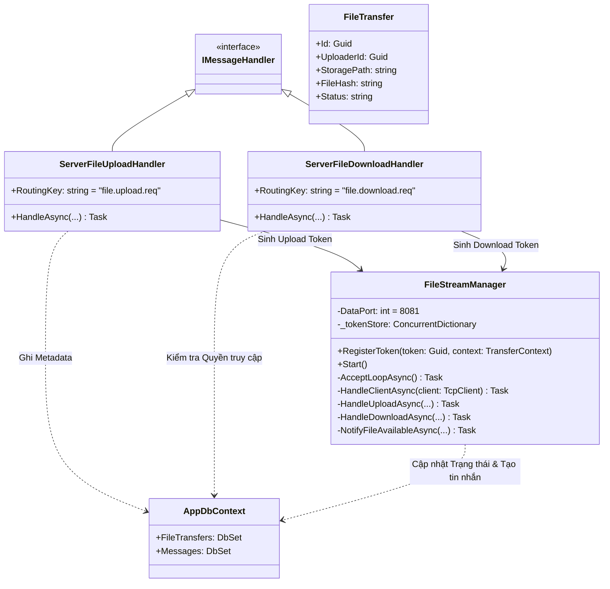
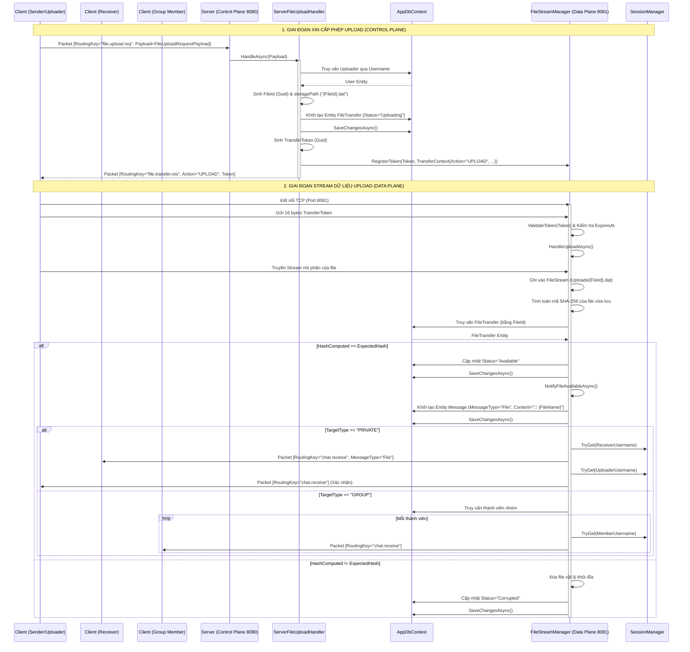
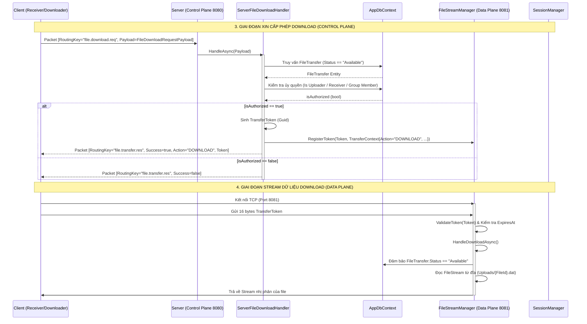

# Báo cáo triển khai Use Case: UC-06 File Transfer

## 1. Mô tả chi tiết
Use case **File Transfer (Truyền File & Lưu Lịch Sử)** được triển khai theo kiến trúc Store & Forward kết hợp 2 luồng riêng biệt để đảm bảo hiệu suất và bảo mật:
1. **Control Plane (Port 8080 - TCP)**: Quản lý Metadata của file và kiểm soát truy cập. 
   - Khi có yêu cầu Upload (`file.upload.req`), Server khởi tạo một bản ghi `FileTransfer` (Trạng thái: "Uploading") và trả về một `TransferToken` thông qua `FileStreamManager`.
   - Khi có yêu cầu Download (`file.download.req`), Server kiểm tra phân quyền và trạng thái file ("Available"), nếu hợp lệ cũng sẽ trả về một `TransferToken`.
2. **Data Plane (Port 8081 - TCP)**: Chuyên trách luồng nhị phân thông qua `FileStreamManager`. 
   - Client kết nối đến port này, gửi 16 bytes chứa `TransferToken` để xác thực.
   - Nếu là Upload, Server đọc luồng và ghi vào file vật lý, tính toán lại mã SHA-256 để đối chiếu. Nếu toàn vẹn, cập nhật trạng thái "Available", tự động sinh bản ghi `Message` (loại "File") và kích hoạt Broadcast thông báo qua gói tin `chat.receive` (hoạt động giống như gửi tin nhắn thông thường). Nếu sai hash, file bị xóa và trạng thái chuyển thành "Corrupted".
   - Nếu là Download, Server đọc file từ đĩa và gửi qua stream.

## 2. Thiết kế lớp chi tiết (Class Design)

## 3. Biểu đồ tuần tự (Sequence Diagram)
Dưới đây là sơ đồ chi tiết được chia thành 2 phần: Quá trình Upload và Quá trình Download.

### 3.1. Quá trình Upload
Biểu đồ minh họa quá trình Upload và phát thông báo khi file sẵn sàng.

### 3.2. Quá trình Download
Biểu đồ minh họa quá trình yêu cầu và tải file về máy khách.

