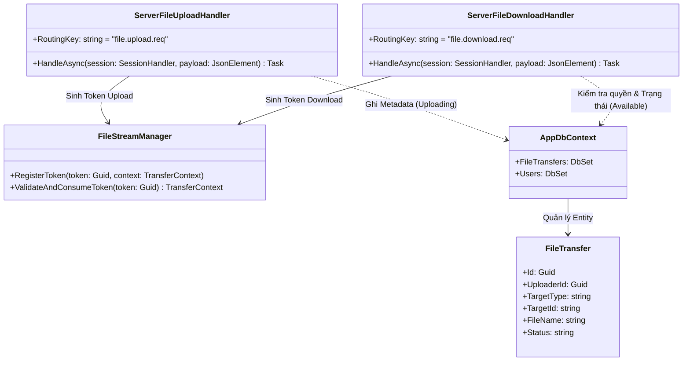
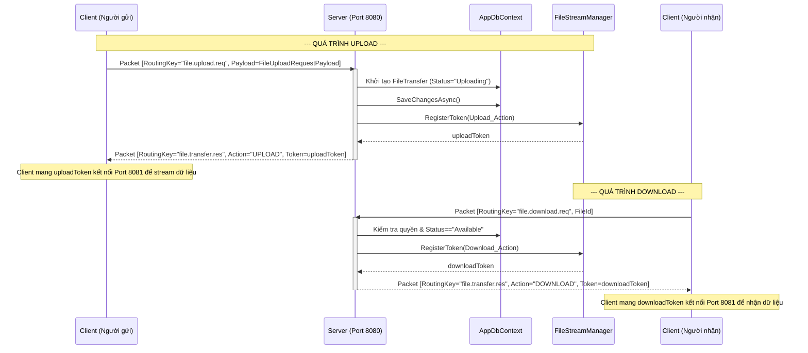

# Báo cáo triển khai Use Case: UC-06 File Transfer

## 1. Mô tả chi tiết
Use case **File Transfer (Truyền File & Lưu Lịch Sử)** được triển khai theo kiến trúc Store & Forward kết hợp 2 luồng riêng biệt:
1. **Control Plane (Port 8080 - TCP)**: Quản lý Metadata của file. Client gửi yêu cầu `file.upload.req` hoặc `file.download.req`. Server tạo bản ghi trong bảng `FileTransfer`, xác thực quyền truy cập, sau đó sinh ra một `TransferToken` thông qua `FileStreamManager`.
2. **Data Plane (Port 8081 - TCP)**: Chuyên trách truyền dòng dữ liệu (Stream) thực tế thông qua `FileStreamHandler`. Client mang `TransferToken` kết nối tới cổng này để upload hoặc download bytes nhị phân, giảm tải cho luồng Control.

## 2. Thiết kế lớp chi tiết (Class Design)
Dưới đây là sơ đồ lớp các thành phần tham gia (tập trung vào Control Plane):

## 3. Biểu đồ tuần tự (Sequence Diagram)
Biểu đồ mô tả quá trình cấp phát Token upload và download.

