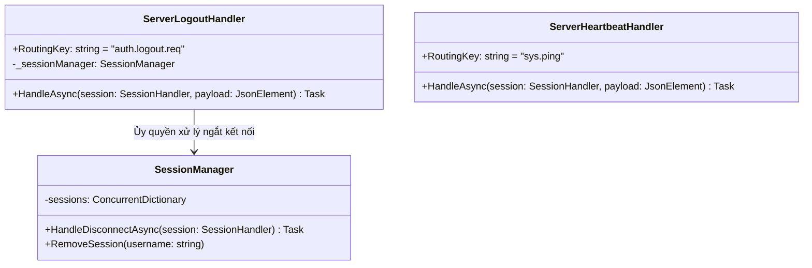
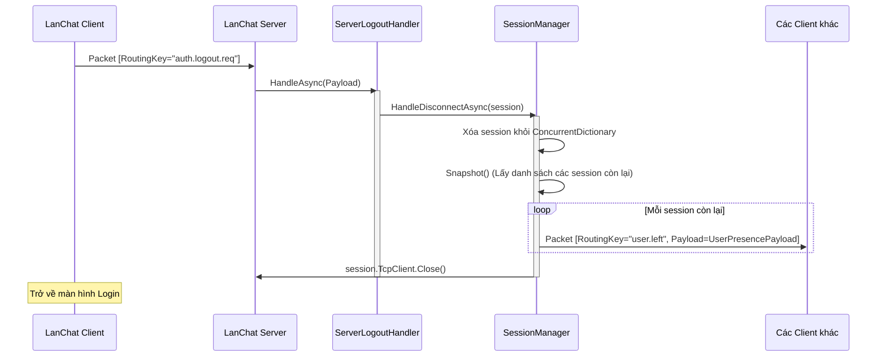

# Báo cáo triển khai Use Case: UC-07 User Logout / Disconnect

## 1. Mô tả chi tiết
Use case **User Logout / Disconnect (Đăng xuất / Ngắt kết nối)** quản lý việc người dùng chủ động rời mạng hoặc bị đứt kết nối. 
Luồng sự kiện đi qua `ServerLogoutHandler` (chủ động) hoặc ngắt kết nối vật lý. Trong cả hai trường hợp, `SessionManager.HandleDisconnectAsync()` đều được gọi để dọn dẹp bộ nhớ, gửi broadcast `user.left` tới những người còn lại để họ cập nhật UI kịp thời.

## 2. Thiết kế lớp chi tiết (Class Design)

## 3. Biểu đồ tuần tự (Sequence Diagram)

