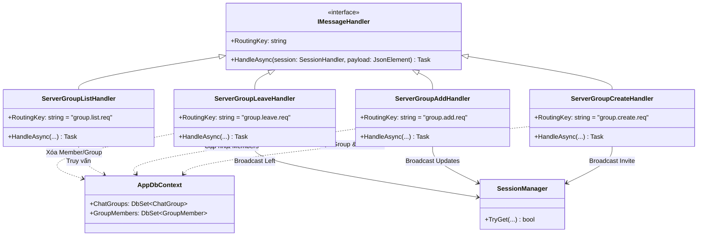
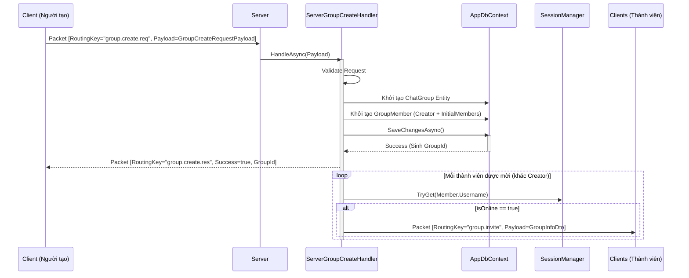

# Báo cáo triển khai Use Case: UC-08 Group Management

## 1. Mô tả chi tiết
Use case **Group Management (Tạo nhóm chat và quản lý)** cho phép người dùng tạo nhóm mới, thêm thành viên vào nhóm, rời nhóm, và liệt kê các nhóm mình đang tham gia.
Tất cả dữ liệu về nhóm (`ChatGroup`) và thành viên (`GroupMember`) được lưu trong Database, đảm bảo dữ liệu nhóm có tính vĩnh viễn (Persistent). Khi có các thay đổi về thành viên, Server sẽ Broadcast các gói tin (`group.invite`, `group.member.added`, `group.member.left`) đến các thành viên Online liên quan.

## 2. Thiết kế lớp chi tiết (Class Design)

## 3. Biểu đồ tuần tự (Sequence Diagram - Group Create)
Dưới đây là biểu đồ tạo nhóm điển hình. Các luồng (Add/Leave/List) cũng theo mô hình tương tự: Truy vấn DB -> Cập nhật -> Broadcast cho Online Users.

