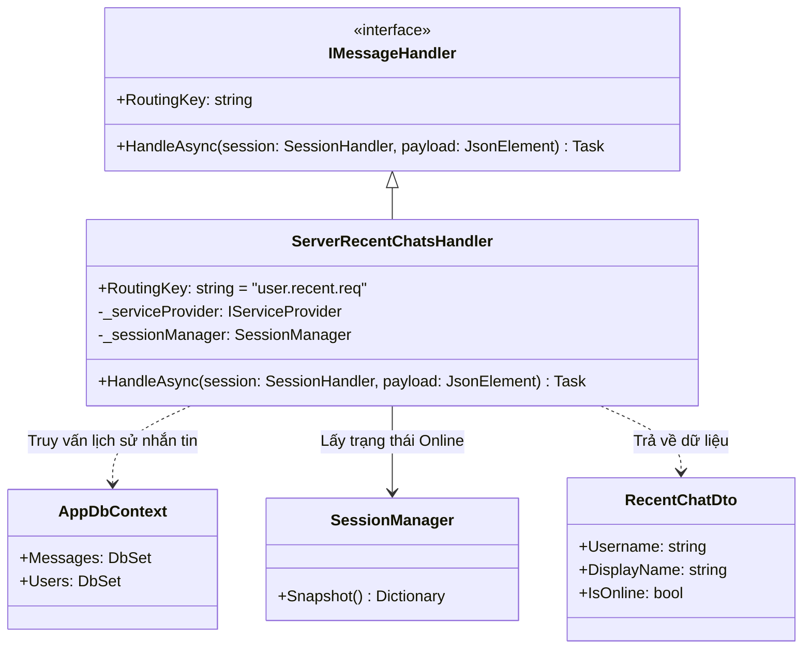
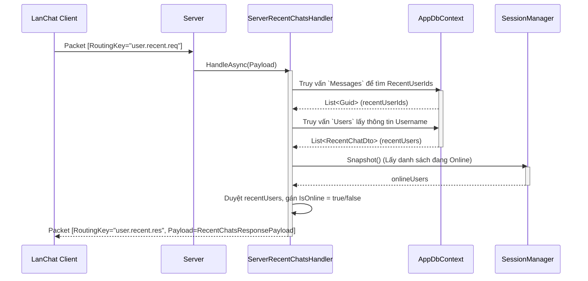

# Báo cáo triển khai Use Case: UC-09 Get Recent Chats

## 1. Mô tả chi tiết
Use case **Get Recent Chats (Lấy danh sách trò chuyện gần đây)** là một tính năng mở rộng, giúp lấy danh sách những người dùng mà Client đã từng nhắn tin (PRIVATE).
Hệ thống lấy thông tin này bằng cách truy vấn bảng `Messages` trong Database để tìm kiếm các bản ghi có liên quan đến `SenderId` hoặc `ReceiverId` của User hiện tại. Đồng thời, kết hợp với `SessionManager` để kiểm tra và trả về trạng thái hoạt động thực (IsOnline) của những người dùng này.

## 2. Thiết kế lớp chi tiết (Class Design)

## 3. Biểu đồ tuần tự (Sequence Diagram)

