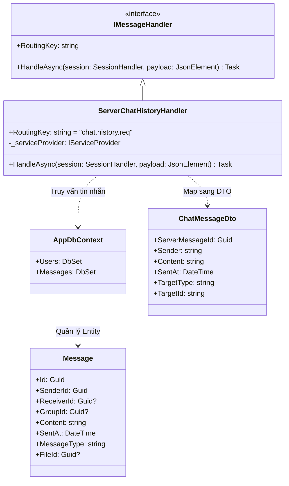
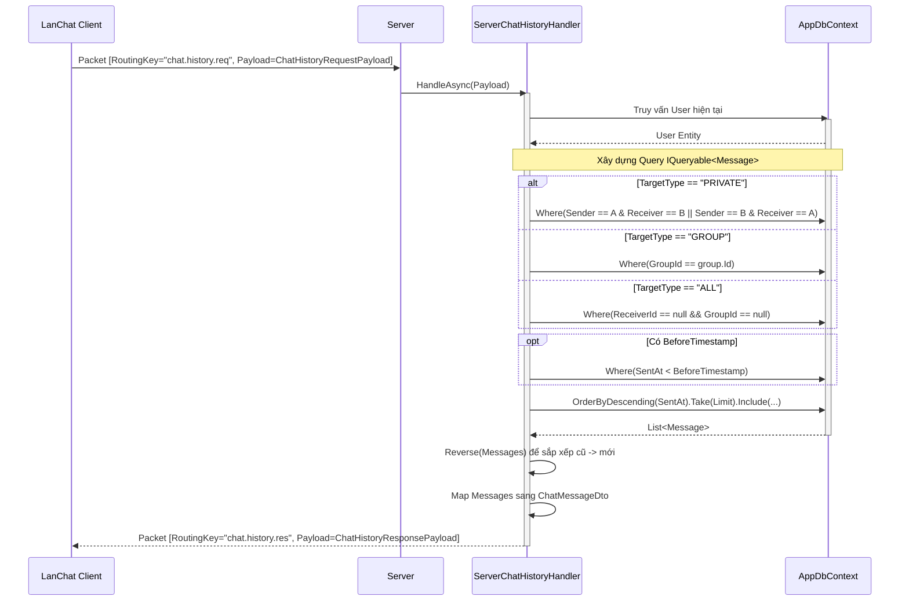

# Báo cáo triển khai Use Case: UC-10 Chat History

## 1. Mô tả chi tiết
Use case **Chat History (Lấy lịch sử tin nhắn)** là một tính năng mở rộng nhằm cung cấp khả năng xem lại các tin nhắn cũ trong một cuộc trò chuyện (Cá nhân, Nhóm, hoặc Toàn mạng).
Khi nhận được yêu cầu, Server sẽ truy vấn Entity Framework (`AppDbContext`) để lấy danh sách tin nhắn thỏa mãn điều kiện `TargetType` và `TargetId`. Quá trình này có hỗ trợ phân trang (Pagination) thông qua tham số `BeforeTimestamp` và `Limit`.

## 2. Thiết kế lớp chi tiết (Class Design)

## 3. Biểu đồ tuần tự (Sequence Diagram)

