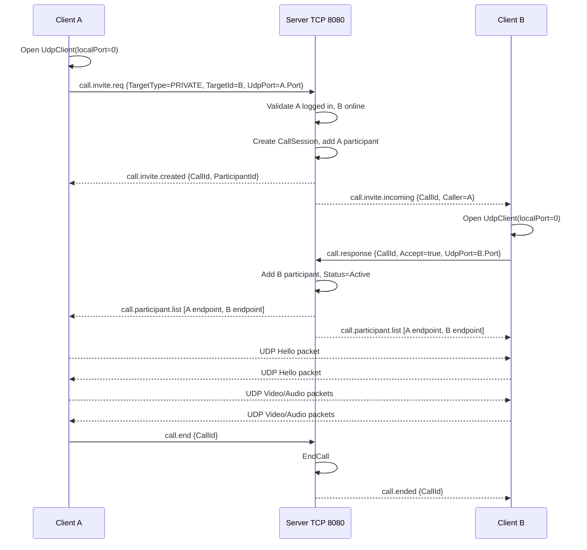

# Thiết kế triển khai Use Case: UC-11 Video Call qua UDP

## 1. Mục tiêu
Use case **Video Call** bổ sung khả năng gọi video cá nhân và gọi video nhóm nhỏ trong mạng LAN.

Thiết kế này bám theo kiến trúc hiện tại của dự án:

- **TCP port 8080** tiếp tục là kênh control/signaling thông qua `MessageEnvelope`, `RoutingKeys`, `MessageDispatcher`, `IMessageHandler`, `SessionHandler`.
- **UDP** được dùng riêng cho media audio/video realtime.
- Server không chuyển tiếp frame video/audio. Server chỉ xác thực, tạo phiên gọi, gửi lời mời, phân phối danh sách endpoint UDP và dọn trạng thái cuộc gọi.
- Không sửa database hiện có. Trạng thái cuộc gọi realtime được giữ trong RAM bằng `CallSessionManager`.

Phạm vi hỗ trợ:

- **PRIVATE:** gọi 1-1 giữa hai user online.
- **GROUP:** gọi nhóm nhỏ bằng UDP P2P mesh, khuyến nghị tối đa 5 participant.

## 2. Kiến trúc UC-11

```text
Client A UI
  -> TCP 8080 MessageEnvelope: call.invite.req / call.response / call.end
  -> UDP Media Plane: gửi video/audio packet trực tiếp tới Client B/C/...

Server
  -> TCP 8080: xử lý signaling bằng Handler hiện có pattern
  -> RAM: quản lý CallSession, participant, UDP endpoint
  -> Không nhận/gửi frame video/audio

Client B UI
  -> TCP 8080 MessageEnvelope: accept/reject, media state
  -> UDP Media Plane: nhận/gửi video/audio packet trực tiếp
```

Lý do dùng UDP cho media:

- Video/audio realtime cần độ trễ thấp.
- Mất một vài packet/frame có thể bỏ qua, không nên chờ retransmit như TCP.
- Nếu truyền media bằng TCP `MessageEnvelope`, hệ thống sẽ bị overhead JSON, AES, TCP framing và handler dispatch liên tục.
- UDP cho phép Client bỏ frame trễ, reassemble frame mới nhất và giữ trải nghiệm realtime tốt hơn trong LAN.

## 3. Thành phần cần thêm

### 3.1. Shared
- `RoutingKeys`: thêm các key `call.*`.
- `Payloads`: thêm payload signaling.
- `Media`: thêm định nghĩa packet header UDP dùng chung cho Client gửi/nhận.

### 3.2. Server
- `CallSessionManager`: quản lý phiên gọi trong RAM.
- `CallSession`: lưu `CallId`, caller, target, participant, UDP endpoint, trạng thái.
- `ServerCallInviteHandler`: tạo lời mời gọi.
- `ServerCallResponseHandler`: xử lý accept/reject.
- `ServerCallMediaStateHandler`: chuyển tiếp trạng thái bật/tắt camera/microphone.
- `ServerCallEndHandler`: rời/kết thúc cuộc gọi.

### 3.3. Client
- `CallService`: API gọi video, accept/reject, end call.
- `UdpMediaTransport`: mở UDP socket, gửi/nhận packet media.
- `VideoCaptureService`: lấy frame camera, encode JPEG.
- `AudioCaptureService`: lấy audio PCM16 mono theo từng packet ngắn.
- `ClientCallInviteHandler`, `ClientCallParticipantListHandler`, `ClientCallEndedHandler`, `ClientCallMediaStateHandler`.
- UI gọi video trong WPF.

## 4. RoutingKey cần bổ sung

```csharp
// Client -> Server: yêu cầu tạo cuộc gọi
public const string CallInviteReq = "call.invite.req";

// Server -> Caller: đã tạo phiên gọi
public const string CallInviteCreated = "call.invite.created";

// Server -> Receiver(s): có lời mời gọi đến
public const string CallInviteIncoming = "call.invite.incoming";

// Server -> Caller: tạo cuộc gọi thất bại
public const string CallInviteFail = "call.invite.fail";

// Client -> Server: accept/reject lời mời
public const string CallResponse = "call.response";

// Server -> Participants: danh sách participant và UDP endpoint mới nhất
public const string CallParticipantList = "call.participant.list";

// Client -> Server: bật/tắt camera/microphone
public const string CallMediaState = "call.media.state";

// Server -> Participants: participant rời cuộc gọi
public const string CallParticipantLeft = "call.participant.left";

// Client -> Server: kết thúc/rời cuộc gọi
public const string CallEnd = "call.end";

// Server -> Participants: cuộc gọi đã kết thúc
public const string CallEnded = "call.ended";
```

Không cần `call.signal` kiểu WebRTC trong bản UDP tự triển khai này, vì Client chỉ cần nhận danh sách UDP endpoint từ Server rồi gửi UDP trực tiếp.

## 5. Payload TCP cần bổ sung

### 5.1. CallInviteRequestPayload

```csharp
public sealed class CallInviteRequestPayload
{
    public string TargetType { get; set; } = "PRIVATE"; // PRIVATE | GROUP
    public string TargetId { get; set; } = string.Empty; // username hoặc groupId
    public int UdpPort { get; set; } // UDP port Client đã mở để nhận media
    public bool CameraEnabled { get; set; } = true;
    public bool MicrophoneEnabled { get; set; } = true;
}
```

### 5.2. CallInviteCreatedPayload

```csharp
public sealed class CallInviteCreatedPayload
{
    public Guid CallId { get; set; }
    public ushort ParticipantId { get; set; }
    public int MaxP2PMeshParticipants { get; set; }
}
```

### 5.3. CallInviteIncomingPayload

```csharp
public sealed class CallInviteIncomingPayload
{
    public Guid CallId { get; set; }
    public string Caller { get; set; } = string.Empty;
    public string TargetType { get; set; } = string.Empty;
    public string TargetId { get; set; } = string.Empty;
    public bool CallerCameraEnabled { get; set; }
    public bool CallerMicrophoneEnabled { get; set; }
}
```

### 5.4. CallResponsePayload

```csharp
public sealed class CallResponsePayload
{
    public Guid CallId { get; set; }
    public bool Accept { get; set; }
    public int UdpPort { get; set; } // bắt buộc nếu Accept=true
    public bool CameraEnabled { get; set; } = true;
    public bool MicrophoneEnabled { get; set; } = true;
    public string? Reason { get; set; }
}
```

### 5.5. CallParticipantDto

```csharp
public sealed class CallParticipantDto
{
    public ushort ParticipantId { get; set; }
    public string Username { get; set; } = string.Empty;
    public string IpAddress { get; set; } = string.Empty;
    public int UdpPort { get; set; }
    public bool CameraEnabled { get; set; }
    public bool MicrophoneEnabled { get; set; }
}
```

### 5.6. CallParticipantListPayload

```csharp
public sealed class CallParticipantListPayload
{
    public Guid CallId { get; set; }
    public List<CallParticipantDto> Participants { get; set; } = new();
}
```

### 5.7. CallMediaStatePayload

```csharp
public sealed class CallMediaStatePayload
{
    public Guid CallId { get; set; }
    public bool CameraEnabled { get; set; }
    public bool MicrophoneEnabled { get; set; }
}
```

### 5.8. CallEndPayload

```csharp
public sealed class CallEndPayload
{
    public Guid CallId { get; set; }
    public string Reason { get; set; } = "UserEnded"; // UserEnded | Timeout | MediaError | Disconnected
}
```

## 6. Server state cần thêm

### 6.1. CallSession

```csharp
public sealed class CallSession
{
    public Guid CallId { get; init; } = Guid.NewGuid();
    public string Caller { get; init; } = string.Empty;
    public string TargetType { get; init; } = string.Empty; // PRIVATE | GROUP
    public string TargetId { get; init; } = string.Empty;
    public DateTime CreatedAt { get; init; } = DateTime.UtcNow;
    public string Status { get; set; } = "Ringing"; // Ringing | Active | Ended
    public Dictionary<string, CallParticipant> Participants { get; } = new(StringComparer.Ordinal);
    public HashSet<string> InvitedUsers { get; } = new(StringComparer.Ordinal);
    public HashSet<string> RejectedUsers { get; } = new(StringComparer.Ordinal);
}
```

### 6.2. CallParticipant

```csharp
public sealed class CallParticipant
{
    public ushort ParticipantId { get; init; }
    public string Username { get; init; } = string.Empty;
    public string IpAddress { get; set; } = string.Empty;
    public int UdpPort { get; set; }
    public bool CameraEnabled { get; set; }
    public bool MicrophoneEnabled { get; set; }
    public DateTime JoinedAt { get; init; } = DateTime.UtcNow;
}
```

### 6.3. CallSessionManager API

```csharp
public sealed class CallSessionManager
{
    public const int MaxP2PMeshParticipants = 5;

    public CallSession CreateCall(
        string caller,
        string targetType,
        string targetId,
        string callerIpAddress,
        int callerUdpPort,
        bool cameraEnabled,
        bool microphoneEnabled);

    public bool TryGet(Guid callId, out CallSession? call);
    public bool AddParticipant(Guid callId, string username, string ipAddress, int udpPort, bool cameraEnabled, bool microphoneEnabled);
    public bool RejectParticipant(Guid callId, string username);
    public bool RemoveParticipant(Guid callId, string username);
    public bool EndCall(Guid callId);
    public IReadOnlyList<CallParticipantDto> GetParticipantDtos(Guid callId);
    public IReadOnlyList<Guid> RemoveUserFromAllCalls(string username);
}
```

## 7. UDP Media Packet Format

UDP media packet không dùng JSON. Dùng binary header cố định để giảm overhead.

Mục tiêu mỗi UDP datagram: **<= 1200 bytes** để giảm nguy cơ IP fragmentation.

### 7.1. Header

| Field | Size | Mô tả |
|---|---:|---|
| Magic | 4 bytes | ASCII `LCVC` |
| Version | 1 byte | `1` |
| PacketType | 1 byte | `1=Video`, `2=Audio`, `3=Hello`, `4=Ping`, `5=Pong` |
| HeaderLength | 2 bytes | Độ dài header, mặc định `48` |
| CallId | 16 bytes | `Guid` phiên gọi |
| ParticipantId | 2 bytes | ID ngắn do Server cấp |
| Sequence | 4 bytes | Tăng dần theo từng packet |
| TimestampMs | 4 bytes | Timestamp media tương đối |
| FrameId | 4 bytes | ID frame video/audio block |
| FragmentIndex | 2 bytes | Thứ tự fragment |
| FragmentCount | 2 bytes | Tổng số fragment của frame |
| Codec | 1 byte | `1=MJPEG`, `2=PCM16` |
| Flags | 1 byte | bit flags: keyframe, muted, last |
| PayloadLength | 2 bytes | Số byte payload |
| Reserved | 2 bytes | Dự phòng |

Payload nằm ngay sau header.

### 7.2. Codec MVP

Để dễ triển khai trong WPF/.NET:

- **Video MVP:** MJPEG, 320x240 hoặc 640x360, 10-15 FPS, JPEG quality 45-60.
- **Audio MVP:** PCM16 mono, 16 kHz, gói 20 ms. Mỗi packet audio khoảng 640 bytes, không cần fragment.

Sau MVP có thể thay:

- MJPEG -> H.264/VP8 để giảm bandwidth.
- PCM16 -> Opus để giảm bandwidth và tăng chất lượng.

### 7.3. Fragment video

JPEG frame thường lớn hơn 1200 bytes nên phải fragment ở tầng app:

1. Client encode camera frame thành JPEG bytes.
2. Chia frame thành nhiều UDP packet có cùng `FrameId`.
3. Set `FragmentCount` bằng tổng số mảnh.
4. Receiver gom theo khóa `(CallId, ParticipantId, FrameId)`.
5. Nếu thiếu fragment quá `200 ms`, bỏ frame đó.
6. Receiver chỉ render frame hoàn chỉnh mới nhất, bỏ frame cũ/trễ.

## 8. Luồng gọi cá nhân



## 9. Luồng gọi nhóm

1. Caller mở UDP socket.
2. Caller gửi `call.invite.req` với `TargetType=GROUP`, `TargetId=groupId`, `UdpPort`.
3. Server kiểm tra:
   - Caller đã login.
   - `groupId` tồn tại trong `AppDbContext.ChatGroups`.
   - Caller là member trong `AppDbContext.GroupMembers`.
   - Số member online + caller không vượt `MaxP2PMeshParticipants`.
4. Server tạo `CallSession`, thêm caller vào participant.
5. Server gửi `call.invite.incoming` tới các member online trong nhóm.
6. Mỗi receiver accept thì gửi `call.response` kèm UDP port.
7. Server thêm participant, rồi broadcast `call.participant.list` mới cho toàn bộ participant.
8. Mỗi Client gửi UDP `Hello` tới tất cả endpoint khác trong participant list.
9. Media chạy theo P2P mesh:
   - Mỗi Client gửi video/audio của mình tới `N-1` participant còn lại.
   - Mỗi Client nhận `N-1` luồng từ các participant khác.
10. Khi participant rời, Server gửi `call.participant.left` và `call.participant.list` mới.
11. Nếu còn dưới 2 participant, Server kết thúc cuộc gọi.

## 10. Handler logic chi tiết

### 10.1. ServerCallInviteHandler

Input: `CallInviteRequestPayload`

Xử lý:

1. Nếu `session.Username == null`: trả `call.invite.fail: Unauthorized`.
2. Nếu `UdpPort <= 0`: trả `call.invite.fail: InvalidUdpPort`.
3. Lấy `caller = session.Username`.
4. Với `PRIVATE`:
   - Tìm user target theo username.
   - Kiểm tra target online bằng `SessionManager.TryGet`.
   - Tạo `CallSession`.
   - Gửi `call.invite.created` cho caller.
   - Gửi `call.invite.incoming` cho target.
5. Với `GROUP`:
   - Parse `TargetId` thành `Guid groupId`.
   - Kiểm tra group tồn tại.
   - Kiểm tra caller là group member.
   - Lấy member online trừ caller.
   - Nếu không có ai online: fail `NoOnlineParticipants`.
   - Nếu tổng participant dự kiến > `MaxP2PMeshParticipants`: fail `TooManyParticipantsForP2P`.
   - Tạo `CallSession`.
   - Gửi invite cho các member online.

### 10.2. ServerCallResponseHandler

Input: `CallResponsePayload`

Xử lý:

1. Kiểm tra user đã login.
2. Kiểm tra `CallId` tồn tại và user nằm trong `InvitedUsers`.
3. Nếu `Accept=false`:
   - Thêm user vào `RejectedUsers`.
   - Nếu mọi invitee đều reject, `EndCall`.
4. Nếu `Accept=true`:
   - Kiểm tra `UdpPort`.
   - Nếu participant count >= `MaxP2PMeshParticipants`: fail hoặc reject `CallFull`.
   - Thêm participant.
   - Set `Status=Active`.
   - Broadcast `call.participant.list` cho toàn bộ participant.

### 10.3. ServerCallMediaStateHandler

Input: `CallMediaStatePayload`

Xử lý:

1. Kiểm tra user đang là participant của `CallId`.
2. Cập nhật `CameraEnabled`, `MicrophoneEnabled`.
3. Broadcast payload tới các participant còn lại bằng `RoutingKeys.CallMediaState`.

### 10.4. ServerCallEndHandler

Input: `CallEndPayload`

Xử lý:

1. Kiểm tra user đang là participant.
2. Nếu là cuộc gọi PRIVATE hoặc caller kết thúc toàn bộ call:
   - `EndCall`.
   - Broadcast `call.ended`.
3. Nếu là GROUP và user chỉ rời:
   - Remove participant.
   - Broadcast `call.participant.left`.
   - Broadcast `call.participant.list` mới.
   - Nếu participant count < 2 thì `EndCall`.

## 11. Client UDP logic chi tiết

### 11.1. Khởi tạo

1. Khi user bấm gọi hoặc accept:
   - Tạo `UdpClient`.
   - Bind local port `0` để hệ điều hành tự cấp port.
   - Lấy `((IPEndPoint)udp.Client.LocalEndPoint).Port`.
   - Gửi port này lên Server qua TCP payload.
2. Sau khi nhận `call.participant.list`:
   - Lưu map `ParticipantId -> IPEndPoint`.
   - Gửi UDP `Hello` tới từng remote endpoint.
   - Bắt đầu capture audio/video.

### 11.2. Gửi video

1. Capture frame từ camera.
2. Resize về 320x240 hoặc 640x360.
3. Encode JPEG quality 45-60.
4. Chia thành fragment <= 1152 bytes payload.
5. Gửi mỗi fragment tới tất cả remote participant đang bật nhận media.
6. Giới hạn FPS mặc định 10-15 FPS.

### 11.3. Nhận video

1. Receive loop đọc UDP datagram.
2. Validate `Magic`, `Version`, `CallId`, `ParticipantId`.
3. Nếu `PacketType=Video`, gom fragment theo `FrameId`.
4. Nếu đủ fragment trước timeout, ghép JPEG và render lên UI.
5. Nếu thiếu fragment quá `200 ms`, bỏ frame.
6. Nếu nhận frame cũ hơn frame đã render, bỏ qua.

### 11.4. Gửi audio

1. Capture PCM16 mono 16 kHz.
2. Cắt thành block 20 ms.
3. Mỗi block gửi 1 UDP packet `PacketType=Audio`, `Codec=PCM16`.
4. Nếu microphone muted, dừng gửi audio hoặc gửi media state qua TCP.

### 11.5. Nhận audio

1. Validate UDP header.
2. Đưa audio packet vào jitter buffer 60-100 ms.
3. Phát theo thứ tự `Sequence`.
4. Packet trễ quá bỏ qua.

## 12. Performance và giới hạn

### 12.1. Gọi cá nhân
- Server chỉ xử lý signaling, tải rất nhẹ.
- Mỗi Client gửi 1 luồng video và 1 luồng audio.
- Phù hợp với UDP P2P.

### 12.2. Gọi nhóm P2P mesh
Với `N` participant:

- Mỗi Client gửi media tới `N-1` người.
- Mỗi Client nhận media từ `N-1` người.
- Tổng kết nối media hai chiều: `N * (N - 1) / 2`.

Ví dụ:

- 3 người: 3 kết nối media.
- 5 người: 10 kết nối media.
- 10 người: 45 kết nối media, không phù hợp với P2P mesh.

Vì vậy bản UDP P2P mesh nên giới hạn:

```csharp
MaxP2PMeshParticipants = 5;
DefaultVideoWidth = 320;
DefaultVideoHeight = 240;
DefaultVideoFps = 12;
DefaultJpegQuality = 50;
```

Nếu cần nhóm lớn hơn 5 người, cần thiết kế thêm **UDP media relay/SFU** riêng. Khi đó mỗi Client gửi một luồng lên relay, relay phân phối lại cho các Client khác. Phần này là use case mở rộng khác, không nhồi vào `MessageDispatcher`.

## 13. Luồng ngoại lệ

### E1. Người nhận cá nhân offline
1. Server không tạo cuộc gọi.
2. Trả `call.invite.fail` với `Reason=TargetOffline`.

### E2. Caller không thuộc group
1. Server kiểm tra `GroupMembers`.
2. Trả `call.invite.fail` với `Reason=Forbidden`.

### E3. Group không có member online
1. Server không tạo cuộc gọi.
2. Trả `call.invite.fail` với `Reason=NoOnlineParticipants`.

### E4. Group quá lớn cho P2P mesh
1. Server không tạo cuộc gọi.
2. Trả `call.invite.fail` với `Reason=TooManyParticipantsForP2P`.

### E5. UDP không thông
1. Client gửi UDP `Hello` nhưng không nhận được packet từ remote sau timeout, ví dụ 5 giây.
2. Client hiển thị lỗi media connection.
3. Client gửi `call.end` với `Reason=UdpTimeout` nếu không còn participant kết nối được.

### E6. Participant mất kết nối TCP
1. `SessionManager.HandleDisconnectAsync` phát hiện disconnect hoặc heartbeat timeout.
2. Server gọi `CallSessionManager.RemoveUserFromAllCalls(username)`.
3. Server broadcast `call.participant.left` và `call.participant.list` mới.
4. Nếu cuộc gọi còn dưới 2 participant, Server broadcast `call.ended`.

## 14. Business Rules

- User phải login mới được tạo hoặc tham gia cuộc gọi.
- Cuộc gọi PRIVATE chỉ tạo khi target online.
- Cuộc gọi GROUP chỉ tạo khi caller là member của group.
- Server không xử lý frame media, chỉ xử lý signaling.
- UDP media packet dùng binary format, không dùng JSON.
- Media UDP bản MVP có thể không mã hóa; nếu cần bảo mật media, thêm `MediaKey` theo call và gửi key qua TCP đã mã hóa AES cho từng participant.
- Gọi nhóm P2P mesh bắt buộc giới hạn participant để bảo vệ CPU/network phía Client.
- Frame/video packet trễ được bỏ qua, không retry.

## 15. Postconditions

### Success
- `CallSession` được tạo trong RAM.
- Các participant nhận được danh sách UDP endpoint.
- Client gửi/nhận được UDP Hello.
- Audio/video được truyền trực tiếp qua UDP giữa các Client.

### Failure
- Không tạo `CallSession` nếu validation fail.
- Dọn `CallSession` nếu UDP setup timeout hoặc participant rời hết.
- Client UI quay về trạng thái trước khi gọi và hiển thị reason cụ thể.

## 16. Priority
High
