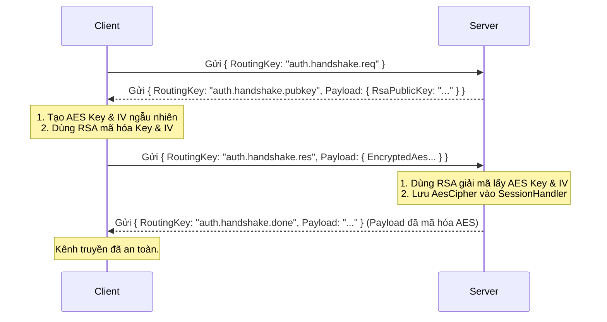

# UC-01: Secure Handshake - Đặc tả Thiết kế Lớp

## 1. Tổng quan thiết kế
Để triển khai luồng trao đổi khóa bảo mật, hệ thống sử dụng kiến trúc **Mã hóa Lai (Hybrid Encryption)**:
- **RSA (Bất đối xứng):** Dùng một lần duy nhất để trao đổi khóa an toàn. Client mã hóa khóa đối xứng bằng Public Key của Server.
- **AES (Đối xứng):** Dùng để mã hóa/giải mã toàn bộ dữ liệu nghiệp vụ sau khi Handshake thành công. Tốc độ cao hơn RSA rất nhiều.

Thiết kế này tuân thủ nguyên tắc **Payload-Only Encryption**, nghĩa là chỉ phần `Payload` của `MessageEnvelope` được mã hóa, trong khi `RoutingKey` vẫn giữ nguyên dạng `plaintext` để `MessageDispatcher` có thể định tuyến.

---

## 2. Thiết kế các thành phần trong Project `LanChat.Shared`
Đây là nền tảng chứa các lớp và công cụ dùng chung cho cả Client và Server.

### 2.1. Hằng số Routing Keys
Để tránh "magic strings", các Routing Key cho luồng Handshake được định nghĩa trong một lớp tĩnh.

```csharp
// Trong LanChat.Shared/Constants/RoutingKeys.cs
public static partial class RoutingKeys
{
    // Client -> Server: Yêu cầu khóa công khai
    public const string HandshakeReq = "auth.handshake.req";
    
    // Server -> Client: Gửi trả khóa công khai
    public const string HandshakePubKey = "auth.handshake.pubkey";
    
    // Client -> Server: Gửi trả khóa AES đã được mã hóa
    public const string HandshakeRes = "auth.handshake.res";
    
    // Server -> Client: Thông báo Handshake thành công
    public const string HandshakeDone = "auth.handshake.done";
}
```

### 2.2. Lớp Truyền tải Dữ liệu (Payload Models / DTOs)
Các lớp này định nghĩa cấu trúc dữ liệu cho các gói tin trong luồng Handshake.

**A. `HandshakePubKeyPayload.cs`**
- **RoutingKey:** `auth.handshake.pubkey`
- **Mô tả:** Chứa Public Key của Server gửi cho Client.

| Tên Thuộc tính | Kiểu dữ liệu | Mô tả |
| :--- | :--- | :--- |
| `RsaPublicKey` | `string` | Chuỗi XML hoặc PEM chứa khóa công khai của Server. |

**B. `HandshakeResponsePayload.cs`**
- **RoutingKey:** `auth.handshake.res`
- **Mô tả:** Chứa khóa AES đã được Client mã hóa và gửi lên Server.

| Tên Thuộc tính | Kiểu dữ liệu | Mô tả |
| :--- | :--- | :--- |
| `EncryptedAesKey`| `byte[]` | Khóa AES đã được mã hóa bằng RSA. |
| `EncryptedAesIV` | `byte[]` | Vector khởi tạo (IV) của AES đã được mã hóa bằng RSA. |

### 2.3. Lớp Tiện ích Bảo mật (Security Utilities)

**A. `RsaManager.cs`**
- **Vai trò:** Quản lý việc tạo khóa RSA (tại Server) và các thao tác mã hóa/giải mã RSA.

| Phương thức | Vai trò | Nơi sử dụng | Ghi chú |
| :--- | :--- | :--- | :--- |
| `GetPublicKey()` | Lấy chuỗi Public Key. | Server | |
| `Decrypt(data)`| Dùng Private Key để giải mã. | Server | Dùng cho gói tin `HandshakeRes`. |
| `Encrypt(data, key)`| Dùng Public Key để mã hóa. | Client | Dùng để mã hóa AES Key & IV. |

*Lưu ý: Luôn sử dụng Padding `RSAEncryptionPadding.OaepSHA256` để đảm bảo an toàn.*

**B. `AesCipher.cs`**
- **Vai trò:** Quản lý việc tạo khóa AES (tại Client) và mã hóa/giải mã dữ liệu sau Handshake.

| Phương thức | Vai trò | Nơi sử dụng | Ghi chú |
| :--- | :--- | :--- | :--- |
| `Encrypt(plainText)` | Mã hóa chuỗi JSON thành Base64. | Client/Server | Sau khi Handshake thành công. |
| `Decrypt(cipherText)`| Giải mã chuỗi Base64 về JSON. | Client/Server | Sau khi Handshake thành công. |

---

## 3. Thiết kế các thành phần trong Project `LanChat.Messaging`

### 3.1. Cập nhật `SessionHandler`
Lớp `SessionHandler` được mở rộng để lưu trữ trạng thái bảo mật của một phiên kết nối.

```csharp
public class SessionHandler
{
    public ISimpleTcpClient TcpClient { get; }
    
    // Lưu trữ bộ mã hóa AES sau khi Handshake thành công
    public AesCipher? Cipher { get; set; } 
    
    // Cờ trạng thái
    public bool IsEncrypted => Cipher != null;
    
    // ... các phương thức khác
}
```
Phương thức `SendAsync` bên trong `SessionHandler` sẽ được cập nhật để tự động kiểm tra `IsEncrypted` và mã hóa `Payload` trước khi gửi.

---

## 4. Thiết kế các thành phần trong Application Layer (Server & Client)

### 4.1. Server-Side Handlers

**A. `ServerHandshakeReqHandler`**
- **RoutingKey:** `auth.handshake.req`
- **Logic:**
  1. Nhận yêu cầu từ Client.
  2. Lấy Public Key từ `RsaManager` (Singleton).
  3. Đóng gói vào `HandshakePubKeyPayload`.
  4. Gửi trả Client qua `session.SendAsync()`.

**B. `ServerHandshakeResHandler`**
- **RoutingKey:** `auth.handshake.res`
- **Logic:**
  1. Nhận gói tin chứa AES Key & IV đã mã hóa.
  2. Dùng `RsaManager` để giải mã.
  3. Tạo một đối tượng `AesCipher` mới từ Key và IV đã giải mã.
  4. **Gán đối tượng `AesCipher` này vào `session.Cipher`**.
  5. Gửi thông báo `auth.handshake.done` về Client (lúc này, `session.SendAsync` sẽ tự động mã hóa gói tin này bằng AES).
  6. **Exception Handling:** Nếu giải mã thất bại (`CryptographicException`), đóng kết nối ngay lập tức.

### 4.2. Client-Side Logic & Handlers

**A. `StartHandshakeAsync()` (Hàm khởi tạo)**
- **Trigger:** Được gọi ngay sau khi Client kết nối TCP thành công.
- **Logic:** Gửi một gói tin rỗng với RoutingKey là `auth.handshake.req` để bắt đầu quá trình.

**B. `ClientHandshakePubKeyHandler`**
- **RoutingKey:** `auth.handshake.pubkey`
- **Logic:**
  1. Nhận Public Key của Server.
  2. Tạo một đối tượng `AesCipher` mới (tự sinh Key & IV ngẫu nhiên).
  3. Dùng `RsaManager.Encrypt()` để mã hóa Key và IV vừa tạo bằng Public Key của Server.
  4. Đóng gói vào `HandshakeResponsePayload`.
  5. **Gán đối tượng `AesCipher` vào `session.Cipher` của Client ngay lập tức**.
  6. Gửi gói tin `auth.handshake.res` lên Server.

**C. `ClientHandshakeDoneHandler`**
- **RoutingKey:** `auth.handshake.done`
- **Logic:**
  1. Nhận thông báo thành công từ Server (gói tin này đã được mã hóa AES).
  2. Xác nhận kênh truyền đã an toàn.
  3. Kích hoạt giao diện người dùng chuyển sang màn hình Đăng nhập/Đăng ký.

---

## 5. Sơ đồ Tuần tự (Sequence Diagram)
Sơ đồ dưới đây minh họa luồng tương tác giữa các thành phần qua các bước.

