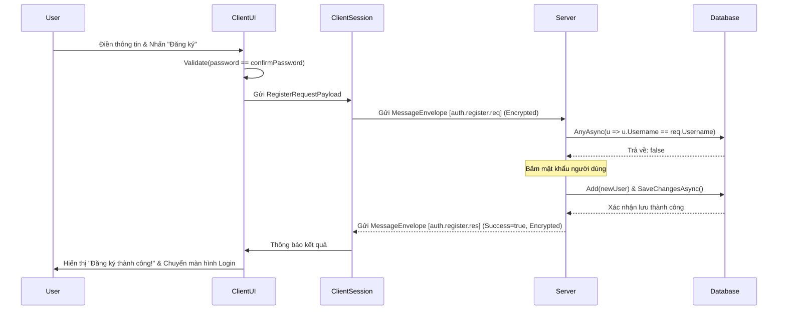

# UC-02: User Registration - Đặc tả Thiết kế Lớp

## 1. Tổng quan thiết kế
Chức năng Đăng ký được triển khai theo luồng Request/Response giữa Client và Server. Mọi gói tin trao đổi đều được mã hóa AES (như đã thiết lập ở UC-01). Server sẽ chịu trách nhiệm chính trong việc xác thực dữ liệu, băm mật khẩu, và tương tác với cơ sở dữ liệu.

- **Client:** Thu thập thông tin, thực hiện kiểm tra cơ bản, gửi yêu cầu.
- **Server:** Xử lý logic nghiệp vụ, ghi vào Database, và gửi trả kết quả.

---

## 2. Thiết kế các thành phần trong Project `LanChat.Shared`

### 2.1. Hằng số Routing Keys
Định nghĩa các "địa chỉ" cho yêu cầu và phản hồi của chức năng Đăng ký.

```csharp
// Trong LanChat.Shared/Constants/RoutingKeys.cs
public static partial class RoutingKeys
{
    // Client -> Server: Yêu cầu đăng ký tài khoản
    public const string AuthRegisterReq = "auth.register.req";
    
    // Server -> Client: Phản hồi kết quả đăng ký
    public const string AuthRegisterRes = "auth.register.res";
}
```

### 2.2. Lớp Truyền tải Dữ liệu (Payload Models / DTOs)

**A. `RegisterRequestPayload.cs`**
- **RoutingKey:** `auth.register.req`
- **Mô tả:** Chứa thông tin mà người dùng gửi lên để tạo tài khoản.

| Tên Thuộc tính | Kiểu dữ liệu | Mô tả |
| :--- | :--- | :--- |
| `Username` | `string` | Tên đăng nhập người dùng muốn tạo. |
| `Password` | `string` | Mật khẩu ở dạng văn bản thuần (plaintext). |

*Lưu ý: Mật khẩu được gửi dạng plaintext nhưng toàn bộ gói tin này đã được bao bọc và mã hóa bằng AES từ trước.*

**B. `RegisterResponsePayload.cs`**
- **RoutingKey:** `auth.register.res`
- **Mô tả:** Chứa kết quả Server xử lý yêu cầu đăng ký.

| Tên Thuộc tính | Kiểu dữ liệu | Mô tả |
| :--- | :--- | :--- |
| `Success` | `bool` | `true` nếu đăng ký thành công, `false` nếu thất bại. |
| `Message` | `string` | Chứa thông điệp lỗi (vd: "Username đã tồn tại"). |

---

## 3. Thiết kế các thành phần trong Project `LanChat.Server`

### 3.1. Lớp Tiện ích `PasswordHasher`
- **Vai trò:** Đóng gói logic băm và xác thực mật khẩu. Lớp này nên được đăng ký dưới dạng Singleton qua Dependency Injection.
- **Nơi đặt:** `LanChat.Server/Security/PasswordHasher.cs`

| Phương thức | Vai trò | Ghi chú |
| :--- | :--- | :--- |
| `HashPassword(password)` | Băm mật khẩu plaintext thành chuỗi Hash. | Sử dụng thuật toán an toàn như `Argon2id` hoặc `BCrypt`. Nếu đơn giản có thể dùng `SHA256` kèm **Salt ngẫu nhiên**. |
| `VerifyPassword(password, hash)`| So khớp mật khẩu plaintext với chuỗi Hash. | Dùng cho chức năng Login (UC-03). |

### 3.2. Lớp Xử lý `ServerRegisterHandler`
- **Vai trò:** Triển khai `IMessageHandler`, chứa toàn bộ logic nghiệp vụ xử lý yêu cầu đăng ký tại Server.
- **Nơi đặt:** `LanChat.Server/Handlers/Auth/ServerRegisterHandler.cs`
- **Dependencies (DI):**
  - `AppDbContext`: Để truy vấn và ghi dữ liệu vào Database.
  - `IPasswordHasher`: Để băm mật khẩu.

**Logic chi tiết trong phương thức `HandleAsync`:**
1.  **Deserialize Payload:** Giải mã `JsonElement` từ `MessageEnvelope` thành `RegisterRequestPayload`.
2.  **Kiểm tra Username:**
    ```csharp
    var usernameExists = await _dbContext.Users
        .AnyAsync(u => u.Username.ToLower() == request.Username.ToLower());
    ```
3.  **Xử lý nếu Username tồn tại (Exception Flow E1):**
    - Nếu `usernameExists` là `true`:
    - Tạo `RegisterResponsePayload` với `Success = false` và `Message = "Username đã tồn tại."`.
    - Gửi gói tin này về Client và `return`.
4.  **Xử lý đăng ký mới (Main Flow):**
    - Nếu `usernameExists` là `false`:
    - Băm mật khẩu: `var passwordHash = _passwordHasher.HashPassword(request.Password);`
    - Tạo một đối tượng `User` entity mới.
    - Gán các giá trị: `Username = request.Username`, `PasswordHash = passwordHash`.
    - Thêm vào DbContext: `_dbContext.Users.Add(newUser);`
    - Lưu vào Database: `await _dbContext.SaveChangesAsync();`
    - Tạo `RegisterResponsePayload` với `Success = true`.
    - Gửi gói tin này về Client.
5.  **Bắt lỗi (Exception Handling):** Bọc toàn bộ logic truy vấn DB trong `try-catch` để xử lý các lỗi như mất kết nối Database.

---

## 4. Thiết kế các thành phần trong Project `LanChat.Client`

### 4.1. Logic tại Giao diện Người dùng (UI Layer)
- **Trigger:** Sự kiện click nút "Register" trên form đăng ký.
- **Logic:**
  1. **Validation (Exception Flow E2):**
     - Kiểm tra các trường `Username`, `Password`, `ConfirmPassword` không được rỗng.
     - Kiểm tra `Password == ConfirmPassword`.
     - Nếu không hợp lệ, hiển thị thông báo lỗi trên UI và không gửi gói tin.
  2. **Gửi yêu cầu (Main Flow):**
     - Tạo một `RegisterRequestPayload` từ dữ liệu trên form.
     - Đóng gói vào `MessageEnvelope` với `RoutingKey = RoutingKeys.AuthRegisterReq`.
     - Gọi `session.SendAsync(envelope)` để gửi đi.
     - (Tùy chọn) Vô hiệu hóa nút "Register" để tránh người dùng nhấn 2 lần.

### 4.2. Lớp Xử lý `ClientRegisterResponseHandler`
- **Vai trò:** Triển khai `IMessageHandler`, nhận và xử lý phản hồi từ Server.
- **Nơi đặt:** `LanChat.Client/Handlers/Auth/ClientRegisterResponseHandler.cs`
- **Logic chi tiết trong phương thức `HandleAsync`:**
  1. **Deserialize Payload:** Giải mã `JsonElement` thành `RegisterResponsePayload`.
  2. **Cập nhật UI:**
     - `if (response.Success)`:
       - Hiển thị một `MessageBox` hoặc `Notification` với thông điệp: "Đăng ký thành công! Vui lòng đăng nhập."
       - Tự động chuyển người dùng về màn hình Login.
     - `else`:
       - Hiển thị `MessageBox` với thông điệp lỗi từ `response.Message` (vd: "Username đã tồn tại.").
       - (Tùy chọn) Kích hoạt lại nút "Register".
  3. **Quan trọng:** Toàn bộ logic cập nhật UI phải được thực hiện trên luồng UI chính (Main Thread), sử dụng `Dispatcher.Invoke` (WPF) hoặc `Control.Invoke` (WinForms).

---

## 5. Sơ đồ Tuần tự (Sequence Diagram)

