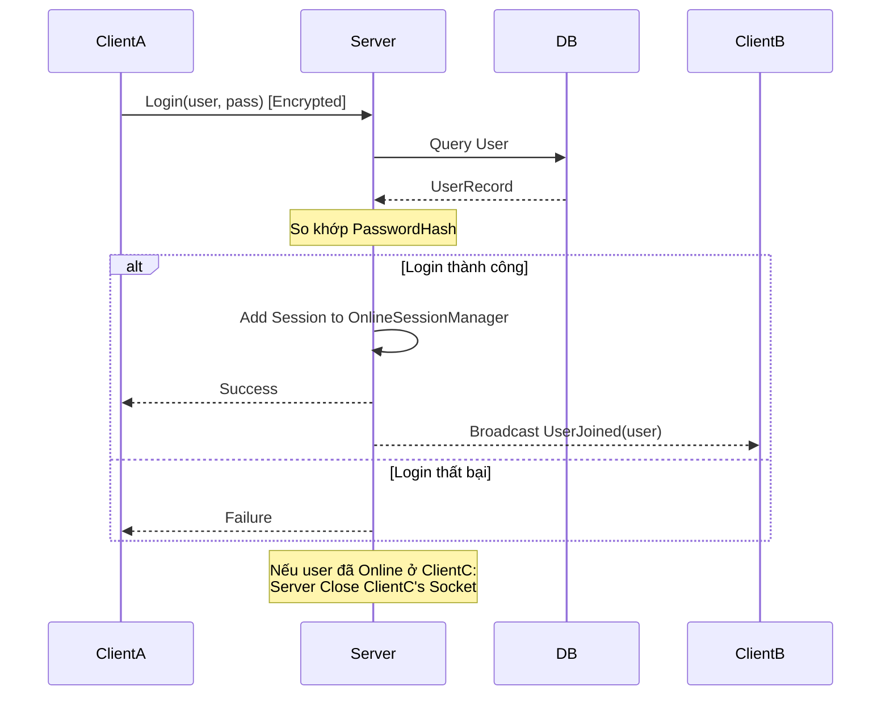

# UC-03: User Login - Đặc tả Thiết kế Lớp

## 1. Thiết kế các thành phần trong `LanChat.Shared`

### 1.1. Routing Keys
```csharp
public static partial class RoutingKeys
{
    public const string AuthLoginReq = "auth.login.req";
    public const string AuthLoginRes = "auth.login.res";
    public const string UserJoined = "user.joined";
    public const string UserLeft = "user.left";
}
```

### 1.2. DTOs
**A. `LoginRequestPayload`**
- **RoutingKey:** `auth.login.req`
- Thuộc tính: `Username` (string), `Password` (string).

**B. `LoginResponsePayload`**
- **RoutingKey:** `auth.login.res`
- Thuộc tính: `Success` (bool), `Message` (string). 
- *Mở rộng:* Có thể chứa thêm `List<GroupInfo>` hoặc `List<MessageHistory>` nếu muốn đồng bộ ngay sau login.

---

## 2. Thiết kế tầng Server (`LanChat.Server`)

### 2.1. Quản lý trạng thái (Session Manager)
Đây là trái tim của UC-03. Chúng ta cần Singleton `OnlineSessionManager` để quản lý sự kết nối.

```csharp
public class OnlineSessionManager
{
    private readonly ConcurrentDictionary<string, SessionHandler> _onlineUsers = new();

    public void AddOrUpdateSession(string username, SessionHandler session)
    {
        // Nếu đã tồn tại, đóng session cũ (để thực hiện logic E2)
        if (_onlineUsers.TryRemove(username, out var oldSession))
        {
            oldSession.TcpClient.Close(); 
        }
        _onlineUsers[username] = session;
    }

    public void RemoveSession(string username) => _onlineUsers.TryRemove(username, out _);

    public IEnumerable<string> GetOnlineUsers() => _onlineUsers.Keys;
}
```

### 2.2. Lớp xử lý `ServerLoginHandler`
- **Nơi đặt:** `LanChat.Server/Handlers/Auth/ServerLoginHandler.cs`
- **Logic chi tiết (`HandleAsync`):**

1.  **Xác thực:**
    - Deserialize `LoginRequestPayload`.
    - Tìm `User` trong DB: `var user = await _dbContext.Users.FirstOrDefaultAsync(u => u.Username == request.Username);`
    - So khớp: `_passwordHasher.VerifyPassword(request.Password, user.PasswordHash)`.
    - Nếu sai -> Trả về `LoginResponsePayload(false, "Sai tên đăng nhập hoặc mật khẩu.")`.

2.  **Đăng nhập (Main Flow):**
    - Nếu đúng, gọi `_sessionManager.AddOrUpdateSession(request.Username, session);`.
    - Gán `session.Username = request.Username;` (Để định danh cho các gói tin sau).
    - Gửi `LoginResponsePayload(true, "Success")`.

3.  **Broadcast (UC-03.7):**
    - Lặp qua `_onlineUsers`, gửi gói tin `RoutingKeys.UserJoined` (Payload: `{ "Username": request.Username }`) cho tất cả các user khác.

---

## 3. Thiết kế tầng Client (`LanChat.Client`)

### 3.1. `ClientLoginResponseHandler`
- **Logic:**
    1.  Nhận `LoginResponsePayload`.
    2.  Nếu `Success`:
        - Lưu `Username` vào biến cục bộ (ví dụ: `AppSession.CurrentUsername`).
        - Chuyển màn hình từ Login sang Dashboard/Main Chat.
        - Load lịch sử chat (nếu có).
    3.  Nếu `Failure`:
        - Hiển thị lỗi lên UI (ví dụ: label đỏ bên dưới nút Login).

---

## 4. Xử lý Exception Flow E2 (Tài khoản đã đăng nhập ở nơi khác)
Đây là quy tắc kinh doanh quan trọng để đảm bảo tính an toàn:

1.  Trong `OnlineSessionManager.AddOrUpdateSession`, chúng ta gọi `oldSession.TcpClient.Close()`.
2.  Việc `Close()` socket sẽ khiến vòng lặp `StartAsync` của `SessionHandler` bên phía Client cũ nhận được `ConnectionClosedException`.
3.  **Tại Client cũ:** Khi bắt được `ConnectionClosedException`, cần kiểm tra: Nếu mình đã login rồi mà đột ngột bị đóng socket, hãy hiện popup: *"Tài khoản của bạn đã được đăng nhập ở một thiết bị khác."* và tự động quay về màn hình Login.

---

## 5. Sơ đồ Tuần tự (Login Flow)



---

## 6. Ghi chú về kiến trúc
*   **Session Binding:** Việc gán `Username` vào `SessionHandler` là một bước cực kỳ quan trọng. Từ đây về sau, mọi gói tin nhận được qua `SessionHandler` này đều có thể xác định ngay: "Ai là người gửi?".
*   **Database:** Như đã thỏa thuận, ta không lưu trường `IsOnline` trong DB, trạng thái chỉ tồn tại trong `ConcurrentDictionary` của Server.
*   **Đồng bộ:** Gói tin `user.joined` gửi cho các Client khác sẽ là tiền đề để các Client cập nhật giao diện danh sách online (UC-04).