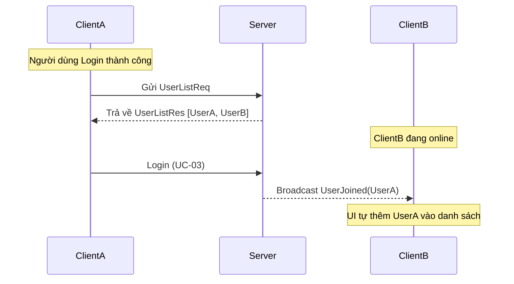

# UC-04: Get Online Users - Đặc tả Thiết kế Lớp

## 1. Thiết kế các thành phần trong `LanChat.Shared`

### 1.1. Routing Keys
```csharp
public static partial class RoutingKeys
{
    public const string UserListReq = "user.list.req"; // Client hỏi danh sách
    public const string UserListRes = "user.list.res"; // Server trả về danh sách
}
```

### 1.2. DTOs
**A. `UserListResponsePayload`**
- **RoutingKey:** `user.list.res`

| Tên Thuộc tính | Kiểu dữ liệu | Mô tả |
| :--- | :--- | :--- |
| `Usernames` | `List<string>` | Danh sách các tên đăng nhập đang online. |

**B. `PresencePayload`** (Dùng cho cả `user.joined` và `user.left`)

| Tên Thuộc tính | Kiểu dữ liệu | Mô tả |
| :--- | :--- | :--- |
| `Username` | `string` | Tên người dùng vừa thay đổi trạng thái. |

---

## 2. Thiết kế tầng Server (`LanChat.Server`)

### 2.1. ServerUserListHandler
- **Nơi đặt:** `LanChat.Server/Handlers/User/ServerUserListHandler.cs`
- **Logic:**
  1. Gọi `_sessionManager.GetOnlineUsernames()` (Lấy từ `ConcurrentDictionary`).
  2. Đóng gói danh sách vào `UserListResponsePayload`.
  3. Gửi gói tin `user.list.res` trực tiếp cho Client yêu cầu.

### 2.2. Cơ chế Broadcast (Tích hợp trong SessionManager)
Để hỗ trợ Alternative Flow A1 (Cập nhật thụ động), `OnlineSessionManager` cần có phương thức Broadcast:

```csharp
public async Task BroadcastAsync(string routingKey, object payload, string? excludeUser = null)
{
    var envelope = new MessageEnvelope { RoutingKey = routingKey, Payload = JsonSerializer.SerializeToElement(payload) };
    
    foreach (var session in _onlineUsers)
    {
        if (session.Key != excludeUser)
        {
            await session.Value.SendAsync(envelope);
        }
    }
}
```
*Ghi chú: Mỗi khi `AddOrUpdateSession` (Login) hoặc `RemoveSession` (Logout), chúng ta gọi hàm `BroadcastAsync` này.*

---

## 3. Thiết kế tầng Client (`LanChat.Client`)

### 3.1. ClientUserListResponseHandler
- **RoutingKey:** `user.list.res`
- **Logic:**
  1. Deserialize payload thành `UserListResponsePayload`.
  2. Truyền danh sách `Usernames` vào `ObservableCollection<string>` (nếu dùng WPF) hoặc `BindingList` (nếu dùng WinForms) để UI tự cập nhật.

### 3.2. ClientPresenceHandler
- **RoutingKey:** `user.joined` hoặc `user.left`
- **Logic:**
  1. Deserialize payload thành `PresencePayload`.
  2. Nếu `user.joined`: Thêm `payload.Username` vào danh sách hiển thị (nếu chưa có).
  3. Nếu `user.left`: Loại bỏ `payload.Username` khỏi danh sách hiển thị.

---

## 4. Sơ đồ Tuần tự (User List Flow)



---

## 5. Các điểm cần lưu ý (Best Practices)

1. **Self-Exclusion:** Khi thiết kế danh sách Online tại Client, bạn nên loại trừ chính Username của mình ra khỏi danh sách hiển thị.
2. **Atomic Updates:** Trong UI, hãy đảm bảo rằng khi nhận `user.joined`, bạn kiểm tra sự tồn tại trước khi thêm để tránh trùng lặp.
3. **Thứ tự:** Nếu muốn danh sách đẹp hơn, ở phía `ServerUserListHandler`, hãy gọi `.OrderBy(u => u)` trước khi gửi về Client.

---