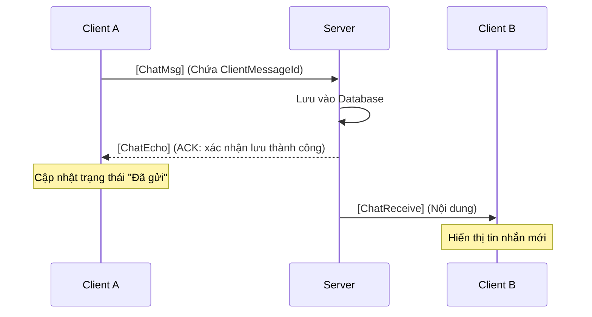

# UC-05: Send Message (Chat) - Đặc tả Thiết kế

## 1. Tổng quan
Use Case này quản lý toàn bộ vòng đời tin nhắn: từ khi người dùng soạn thảo, gửi, Server xác nhận (ACK), lưu trữ, cho đến việc phân phối thời gian thực và truy vấn lịch sử.
**Người dùng có thể gửi tin nhắn tới người dùng khác, nhóm người dùng, hoặc toàn bộ (broadcast).**

## 2. Thiết kế Payload (`LanChat.Shared`)

### 2.1. Routing Keys
```csharp
public static partial class RoutingKeys
{
    public const string ChatMsg         = "chat.msg";       // Client -> Server (Gửi tin)
    public const string ChatEcho        = "chat.echo";      // Server -> Sender (Xác nhận đã lưu)
    public const string ChatReceive     = "chat.recv";      // Server -> Receiver (Nhận tin)
    public const string ChatHistoryReq  = "chat.his.req";   // Client -> Server (Lấy lịch sử)
    public const string ChatHistoryRes  = "chat.his.res";   // Server -> Client (Trả lịch sử)
}
```

### 2.2. DTOs (Data Transfer Objects)

**A. `ChatMessagePayload` (Gửi tin)**
| Thuộc tính | Kiểu | Mô tả |
| :--- | :--- | :--- |
| `ClientMessageId` | `Guid` | ID do Client sinh ra để khớp với ACK. |
| `TargetType` | `string` | "PRIVATE", "GROUP", "ALL" |
| `TargetId` | `string` | Username hoặc GroupID |
| `Content` | `string` | Nội dung tin nhắn (Text/Emoji). |

**B. `ChatEchoPayload` (ACK cho người gửi)**
| Thuộc tính | Kiểu | Mô tả |
| :--- | :--- | :--- |
| `ClientMessageId` | `Guid` | ID trùng khớp với tin nhắn gốc. |
| `ServerMessageId` | `Guid` | ID tin nhắn do Server sinh ra sau khi lưu DB. |
| `SentAt` | `DateTime` | Thời gian Server ghi nhận. |

**C. `ChatMessageDto` (Cấu trúc tin nhắn chuẩn)**
Dùng chung cho cả `ChatReceive` và `ChatHistoryResponse`.
| Thuộc tính | Kiểu | Mô tả |
| :--- | :--- | :--- |
| `ServerMessageId` | `Guid` | ID tin nhắn trong DB. |
| `Sender` | `string` | Username người gửi. |
| `Content` | `string` | Nội dung. |
| `SentAt` | `DateTime` | Thời gian gửi. |

**D. `ChatHistoryRequest` & `ChatHistoryResponse`**
- **Request:** `TargetId` (string), `BeforeTimestamp` (DateTime?), `Limit` (int).
- **Response:** `Messages` (List<ChatMessageDto>), `TargetId` (string).

---

## 3. Thiết kế tầng Server (`LanChat.Server`)

### 3.1. ServerChatHandler (Logic gửi & định tuyến)
1. **Lưu trữ:** Nhận `ChatMessagePayload`, ánh xạ vào Entity `Message`, lưu vào Database qua `AppDbContext`.
2. **Xác nhận:** Gửi gói `ChatEchoPayload` về cho người gửi ngay khi `SaveChangesAsync()` thành công.
3. **Định tuyến (Routing):**
    - **PRIVATE:** `_sessionManager.GetSession(TargetId)` -> Nếu online, gửi gói `ChatReceive` (DTO: `ChatMessageDto`).
    - **GROUP:** Truy vấn danh sách thành viên trong bảng `GroupMembers` -> Lặp qua từng người -> Kiểm tra `SessionManager.IsOnline` -> Gửi `ChatReceive`.
    - **ALL:** Broadcast cho tất cả sessions trừ người gửi.

### 3.2. ServerChatHistoryHandler (Logic phân trang)
1. Truy vấn bảng `Messages` dựa trên `TargetId`.
2. Lọc theo thời gian: `SentAt < BeforeTimestamp` (nếu có).
3. Lấy ra `N` tin nhắn gần nhất (`Take(Limit)`).
4. Ánh xạ sang `ChatMessageDto` và gửi gói `ChatHistoryRes` về Client.

---

## 4. Thiết kế tầng Client (`LanChat.Client`)

### 4.1. Luồng xử lý tin nhắn
1. **Gửi:** Client sinh `ClientMessageId`, hiển thị tin nhắn lên UI với trạng thái `Sending...`. Gửi gói `chat.msg`.
2. **Nhận ACK:** Khi nhận `ChatEcho`, dùng `ClientMessageId` để định vị tin nhắn trong UI, cập nhật trạng thái thành `Sent` và hiển thị `SentAt` từ Server.
3. **Nhận tin nhắn đến:** Khi nhận `ChatReceive`, thêm tin nhắn vào UI (hiển thị rõ nét).
4. **Tải lịch sử:** Khi người dùng cuộn lên trên (Scroll Top) của khung chat, gọi `ChatHistoryReq`. Khi nhận `ChatHistoryRes`, chèn danh sách tin nhắn vào đầu khung chat (Reverse danh sách để giữ thứ tự cũ đến mới).

---

## 5. Quy tắc nghiệp vụ (Business Rules)
1. **Tính toàn vẹn:** Mọi tin nhắn đều phải được lưu vào Database trước khi được chuyển tiếp đến người nhận. Nếu lưu Database lỗi, không được chuyển tiếp tin nhắn.
2. **Đồng bộ thời gian:** Mọi Client phải hiển thị thời gian dựa trên `SentAt` do Server cấp, không dùng thời gian local của máy trạm để tránh sai lệch giờ giữa các user.
3. **Định dạng:** Hỗ trợ UTF-8 cho Emoji/Icon. Client có trách nhiệm encode/decode nếu cần.

---

## 6. Sơ đồ Tuần tự (Message Flow)


