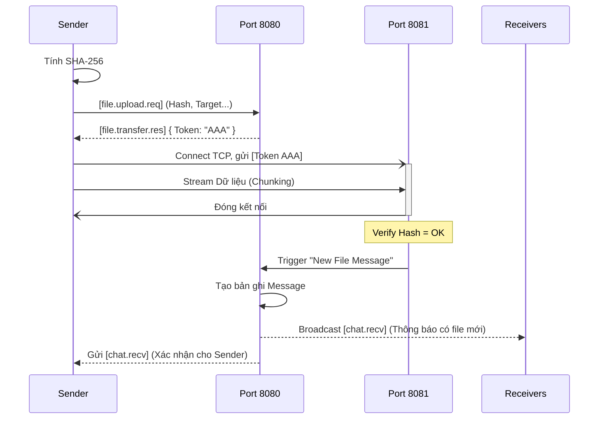
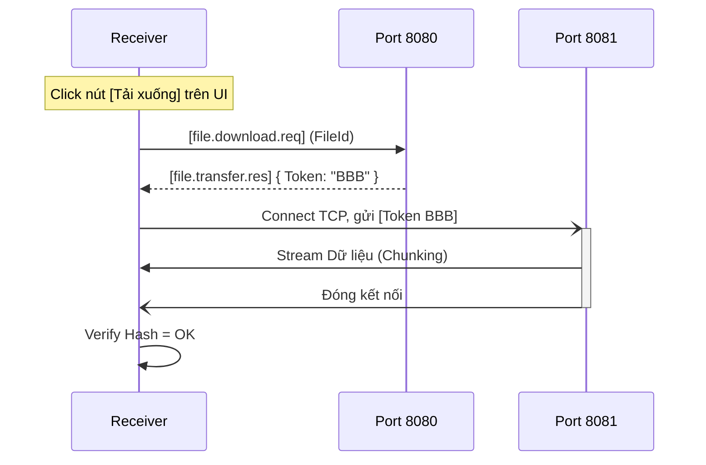

# UC-06: File Transfer (Upload & Download) - Đặc tả Thiết kế

## 1. Tổng quan & Triết lý thiết kế

Use Case này quản lý toàn bộ vòng đời của một phiên truyền tệp tin, từ yêu cầu gửi, quá trình tải lên, thông báo, cho đến khi người nhận tải xuống. Kiến trúc được thiết kế dựa trên mô hình **Store & Forward (Lưu trữ và Chuyển tiếp)** kết hợp **Token-based Authentication** để đạt được các mục tiêu sau:
- **Hiệu năng cao:** Tách biệt luồng điều khiển (Messaging) và luồng dữ liệu (Data Stream) để tối ưu hóa tốc độ truyền.
- **Không giới hạn dung lượng:** Hỗ trợ truyền các tệp tin cực lớn (hàng chục Gigabyte) mà không gây tràn bộ nhớ RAM.
- **Độ tin cậy cao:** Đảm bảo tính toàn vẹn dữ liệu từ đầu đến cuối (End-to-End) và có cơ chế tự động dọn dẹp tài nguyên.
- **Linh hoạt:** Hỗ trợ gửi tệp tin cho cả Cá nhân (1-1) và Nhóm (1-N).

## 2. Phân tách Cổng Dịch vụ
Hệ thống sử dụng hai cổng TCP/IP riêng biệt:
- **Cổng 8080 (Control Plane):** Chịu trách nhiệm cho mọi giao tiếp điều khiển: Đàm phán, cấp quyền, xác thực và gửi thông báo. Mọi dữ liệu trên cổng này đều được mã hóa AES.
- **Cổng 8081 (Data Plane):** Chuyên dụng cho việc truyền dòng byte thô (raw stream) của tệp tin. Cổng này không mã hóa AES để tối đa hóa thông lượng mạng (throughput).

## 3. Thiết kế Cơ sở dữ liệu
Để quản lý lịch sử và trạng thái của các tệp tin, hai bảng sau được cập nhật/thêm vào.

### 3.1. Bảng `FileTransfer` (Lưu trữ Metadata)
| Cột | Kiểu | Mô tả |
| :--- | :--- | :--- |
| `Id` | `Guid` | Khóa chính, định danh duy nhất cho mỗi tệp tin. |
| `UploaderId` | `Guid` | Khóa ngoại tới `User.Id`, định danh người tải lên. |
| `FileName` | `string` | Tên tệp tin gốc do người dùng cung cấp. |
| `FileSize` | `long` | Kích thước tệp tin (bytes). |
| `FileHash` | `string` | **SHA-256 Hash** của tệp tin gốc, dùng để kiểm tra toàn vẹn. |
| `StoragePath` | `string` | Tên tệp tin vật lý trên đĩa Server (sử dụng `Id` để tránh xung đột). |
| `Status` | `string` | Trạng thái: `"Uploading"`, `"Available"`, `"Corrupted"`. |
| `CreatedAt` | `DateTime`| Thời gian bắt đầu yêu cầu upload. |

### 3.2. Bảng `Message` (Tích hợp thông báo)
- **`MessageType` (`string`):** Thêm giá trị `"File"` bên cạnh `"Text"`.
- **`FileId` (`Guid?`):** Khóa ngoại trỏ tới `FileTransfer.Id`, cho biết tin nhắn này chứa tệp tin nào.

## 4. Thiết kế Payload (`LanChat.Shared`)

### 4.1. Routing Keys
```csharp
// Luồng Upload
public const string FileUploadReq   = "file.upload.req";
// Luồng Download
public const string FileDownloadReq = "file.download.req";
// Luồng Phản hồi Token
public const string FileTransferRes = "file.transfer.res";
```

### 4.2. DTOs (Data Transfer Objects)
**A. `FileUploadRequestPayload`**
- **Mục đích:** Client yêu cầu quyền tải tệp tin lên Server.
| Thuộc tính | Kiểu | Mô tả |
| :--- | :--- | :--- |
| `TargetType` | `string` | "PRIVATE" hoặc "GROUP". |
| `TargetId` | `string` | Username hoặc GroupId. |
| `FileName` | `string` | Tên tệp tin. |
| `FileSize` | `long` | Kích thước tệp tin. |
| `FileHash` | `string` | SHA-256 của tệp tin gốc. |

**B. `FileDownloadRequestPayload`**
- **Mục đích:** Client yêu cầu quyền tải một tệp tin đã có trên Server.
| Thuộc tính | Kiểu | Mô tả |
| :--- | :--- | :--- |
| `FileId` | `Guid` | ID của tệp tin muốn tải về. |

**C. `TransferTokenResponsePayload`**
- **Mục đích:** Server cấp "vé" để Client kết nối vào cổng Data Stream.
| Thuộc tính | Kiểu | Mô tả |
| :--- | :--- | :--- |
| `Success` | `bool` | Yêu cầu có được chấp thuận hay không. |
| `Action` | `string` | "UPLOAD" hoặc "DOWNLOAD". |
| `TransferToken`| `Guid` | **"Chìa khóa" dùng một lần trên Port 8081.** |
| `FileId` | `Guid` | ID của file liên quan (để client theo dõi). |

*(Lưu ý: Thông báo có tệp tin mới cho người nhận sẽ sử dụng DTO `ChatMessageDto` và `RoutingKey.ChatReceive` của UC-05).*

## 5. Thiết kế tầng Server (`LanChat.Server`)

### 5.1. `ServerFileReqHandler` (Xử lý trên Port 8080)
- **Khi nhận `FileUploadReq`:**
  1.  Tạo một bản ghi `FileTransfer` trong DB với `Status = "Uploading"`.
  2.  Sinh một `TransferToken` (Guid).
  3.  Lưu Token vào `MemoryCache` với thời hạn 5 phút, kèm theo ngữ cảnh: `{ Action: "UPLOAD", FileId: [ID vừa tạo] }`.
  4.  Trả về `TransferTokenResponsePayload` cho Client.
- **Khi nhận `FileDownloadReq`:**
  1.  Kiểm tra trong DB xem `FileId` có tồn tại và `Status == "Available"` không.
  2.  *(Bảo mật)* Kiểm tra xem người yêu cầu có quyền truy cập file này không (có phải là người nhận hoặc thành viên nhóm không).
  3.  Sinh `TransferToken`, lưu vào `MemoryCache` với ngữ cảnh: `{ Action: "DOWNLOAD", FileId: ... }`.
  4.  Trả về `TransferTokenResponsePayload`.

### 5.2. `FileStreamManager` (Quản lý Port 8081)
Đây là một `TcpListener` chạy độc lập, xử lý luồng byte thô.
1.  **Chờ kết nối:** `await listener.AcceptTcpClientAsync()`.
2.  **Xác thực bằng Token:** Đọc **16 bytes** đầu tiên từ `NetworkStream` để lấy `TransferToken`.
3.  **Tra cứu Token:** Dùng Token để lấy ngữ cảnh (Upload/Download, FileId) từ `MemoryCache`. Nếu không có -> Ngắt kết nối. Xóa Token ngay sau khi tra cứu để chống Replay Attack.
4.  **Xử lý luồng Upload:**
    - Mở `FileStream` để ghi vào đường dẫn vật lý (vd: `Uploads/{FileId}.dat`).
    - Sao chép dữ liệu: `await networkStream.CopyToAsync(fileStream, 81920)`.
    - **Kiểm tra toàn vẹn:** Tính lại SHA-256 của file vừa lưu.
    - Nếu khớp: Cập nhật DB `Status = "Available"`. **Kích hoạt luồng thông báo của UC-05**: Tạo một bản ghi `Message` và gửi `chat.recv` đến đích.
    - Nếu không khớp: Xóa file vật lý, cập nhật DB `Status = "Corrupted"`, báo lỗi cho người gửi.
5.  **Xử lý luồng Download:**
    - Mở `FileStream` để đọc file vật lý.
    - Sao chép dữ liệu: `await fileStream.CopyToAsync(networkStream, 81920)`.

### 5.3. `FileJanitorService` (Dịch vụ Dọn rác)
- Một `Task.Run` hoặc `BackgroundService` chạy định kỳ (mỗi giờ).
- Truy vấn DB tìm các `FileTransfer` có `Status == "Uploading"` và `CreatedAt` đã quá 1 giờ.
- Xóa các bản ghi DB này và các tệp tin vật lý tương ứng trên đĩa để thu hồi tài nguyên.

## 6. Thiết kế tầng Client (`LanChat.Client`)

### 6.1. Logic Gửi File (Sender)
1.  Người dùng chọn file và đích đến. Client tính toán SHA-256 của file.
2.  Gửi `FileUploadReq`. Nhận `TransferTokenResponsePayload`.
3.  Kết nối TCP đến `ServerIP:8081`. Ghi 16 bytes Token lên đầu luồng.
4.  Bắt đầu sao chép `FileStream` (cục bộ) vào `NetworkStream` bằng `CopyToAsync`, đồng thời cập nhật Progress Bar trên UI.
5.  Chờ Server gửi về gói tin `chat.recv` (chứa thông tin file) để xác nhận việc gửi đã hoàn tất và hiển thị "bong bóng file" trong khung chat của chính mình.

### 6.2. Logic Nhận File (Receiver)
1.  UI nhận được gói `chat.recv` từ Server (kết quả của UC-05).
2.  Kiểm tra `MessageType == "File"`, render ra một "bong bóng file" có nút [Tải về].
3.  Khi người dùng nhấn nút:
    - Gửi `FileDownloadReq` kèm `FileId` lấy từ tin nhắn.
    - Nhận `TransferTokenResponsePayload`.
    - Kết nối TCP đến `ServerIP:8081`, gửi Token.
    - Bắt đầu sao chép `NetworkStream` vào một `FileStream` (cục bộ).
    - Tải xong, tính lại SHA-256, so sánh với Hash trong tin nhắn.
    - Nếu khớp: Báo thành công. Nếu không: Báo lỗi và xóa tệp tin tải dở.

---

## 7. Sơ đồ Tuần tự (Sequence Diagram)

### Luồng Upload & Thông báo


### Luồng Download
