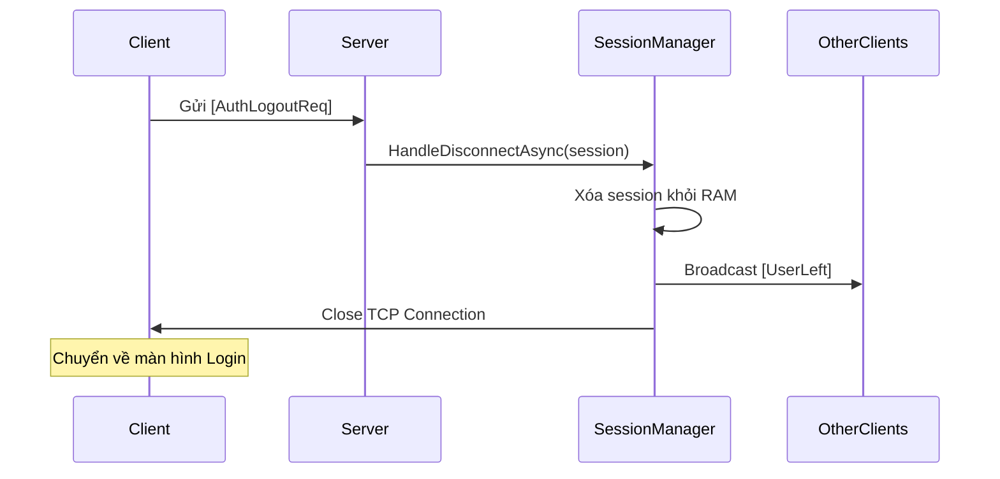
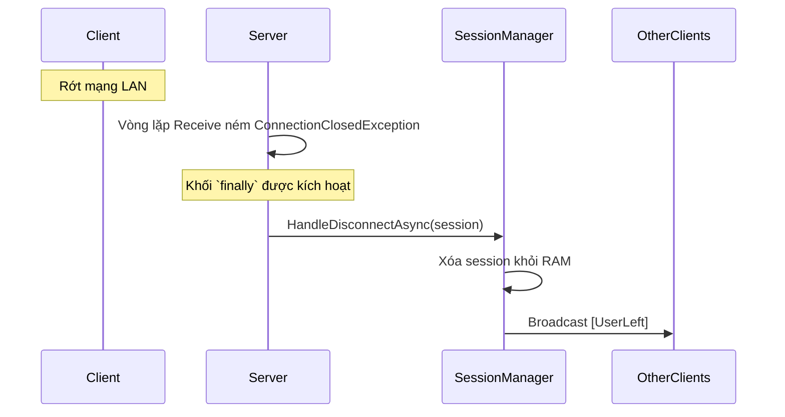

# UC-07: User Logout / Disconnect - Đặc tả Thiết kế

## 1. Tổng quan & Triết lý thiết kế
Use Case này quản lý việc kết thúc một phiên làm việc của người dùng, bao gồm cả hai trường hợp: **Chủ động đăng xuất (Active Logout)** và **Bị ngắt kết nối thụ động (Passive Disconnect)**.

Để đảm bảo tính nhất quán và tuân thủ nguyên tắc **DRY (Don't Repeat Yourself)**, toàn bộ logic dọn dẹp (cleanup logic) sẽ được đóng gói vào một phương thức trung tâm `HandleDisconnectAsync` trong lớp `SessionManager`. Điều này giúp tránh lặp lại mã nguồn và dễ dàng bảo trì khi cần mở rộng tính năng.

## 2. Thiết kế Payload (`LanChat.Shared`)

### 2.1. Routing Keys
```csharp
public static partial class RoutingKeys
{
    // Client -> Server: Yêu cầu đăng xuất
    public const string AuthLogoutReq = "auth.logout.req";
    // Server -> Clients (Broadcast): Thông báo có người rời đi
    public const string UserLeft = "user.left"; // Tái sử dụng từ UC-03
}
```

### 2.2. DTOs (Data Transfer Objects)
- **Yêu cầu Logout (`AuthLogoutReq`):** Không cần DTO. Client chỉ cần gửi một `MessageEnvelope` với `RoutingKey` tương ứng.
- **Thông báo UserLeft (`UserLeft`):** Tái sử dụng `UserPresencePayload` (đã có từ UC-03) chứa thuộc tính `Username` (string).

---

## 3. Thiết kế tầng Server (`LanChat.Server`)

### 3.1. Lớp quản lý `SessionManager`
Đây là trung tâm xử lý cho UC-07, được mở rộng với phương thức `HandleDisconnectAsync`.

| Thuộc tính/Phương thức | Kiểu | Vai trò | Logic chi tiết |
| :--- | :--- | :--- | :--- |
| `_onlineUsers` | `ConcurrentDictionary` | Lưu trữ các session đã được xác thực (đã login). | |
| `HandleDisconnectAsync(session)`| `async Task` | **Phương thức dọn dẹp trung tâm.** | 1. Kiểm tra `session.Username` có tồn tại không. Nếu không (chưa login) -> chỉ đóng socket và kết thúc.<br>2. Nếu đã login, xóa `session` khỏi `_onlineUsers`.<br>3. Gọi `BroadcastAsync` để gửi gói tin `UserLeft` đến các client còn lại.<br>4. Đóng kết nối TCP `session.Close()`.<br>5. *(Tùy chọn)* Cập nhật trạng thái `LastSeen` vào Database. |
| `BroadcastAsync(...)` | `async Task` | Gửi gói tin đến tất cả các session đang online. | Tái sử dụng logic broadcast đã có từ các UC trước. |

### 3.2. Handler cho Logout chủ động (`ServerLogoutHandler`)
- **Vai trò:** Bắt gói tin `auth.logout.req`.
- **Nơi đặt:** `LanChat.Server/Handlers/Auth/ServerLogoutHandler.cs`
- **Dependencies (DI):** `SessionManager`.
- **Logic trong `HandleAsync`:**
  ```csharp
  public async Task HandleAsync(SessionHandler session, JsonElement payload)
  {
      Console.WriteLine($"[Server] Received Logout request from '{session.Username}'.");
      // Ủy quyền toàn bộ logic dọn dẹp cho SessionManager
      await _sessionManager.HandleDisconnectAsync(session);
  }
  ```

### 3.3. Xử lý ngắt kết nối thụ động (`Program.cs`)
Khối `finally` trong vòng lặp chính của Server được tối giản để gọi đến phương thức trung tâm, đảm bảo logic được thực thi nhất quán.

```csharp
// Trong LanChat.Server/Program.cs, bên trong vòng lặp `while(true)`
_ = Task.Run(async () => {
    try
    {
        await sessionHandler.StartAsync();
    }
    catch (Exception ex)
    {
        // Ghi log lỗi kết nối nếu cần
    }
    finally
    {
        // Khi vòng lặp của session kết thúc (do lỗi, ngắt kết nối, hay logout)
        // Luôn gọi đến phương thức dọn dẹp duy nhất.
        await sessionManager.HandleDisconnectAsync(sessionHandler);
    }
});
```

---

## 4. Thiết kế tầng Client (`LanChat.Client`)

### 4.1. Logic nút "Logout" trên UI
- Khi người dùng nhấn nút "Logout":
  1. Gửi gói tin `AuthLogoutReq` lên Server.
  2. Ngay lập tức, Client có thể tự đóng kết nối và chuyển về màn hình Login mà không cần chờ Server phản hồi, giúp trải nghiệm người dùng mượt mà hơn.

### 4.2. Xử lý khi bị ngắt kết nối đột ngột
- Client phải có cơ chế `try-catch` bao bọc vòng lặp nhận tin.
- Khi bắt được `ConnectionClosedException` hoặc các lỗi I/O khác:
  1. Hiển thị thông báo "Mất kết nối với máy chủ."
  2. Tự động chuyển về màn hình Login.

### 4.3. Handler cho `UserLeft`
- **Tên lớp:** `ClientUserPresenceHandler` (Tái sử dụng từ UC-04).
- **Logic:** Khi nhận được gói tin `user.left`, xóa `Username` tương ứng khỏi danh sách người dùng online đang hiển thị trên UI.

---

## 5. Thiết kế Business Rule (Heartbeat)

Để xử lý các kết nối "chết lâm sàng", một cơ chế Ping/Pong sẽ được triển khai.
- **Client:** Sử dụng một `Timer`, cứ sau 30 giây lại gửi gói tin `sys.ping`.
- **Server:**
  - **`SessionHandler`:** Thêm thuộc tính `LastActivityTime`. Cập nhật thời gian này mỗi khi nhận được bất kỳ gói tin nào.
  - **`ServerHeartbeatHandler` (`sys.ping`):** Một Handler rỗng, chỉ có tác dụng làm mới `LastActivityTime`.
  - **`SessionJanitor` (Background Service):** Một tiến trình nền chạy định kỳ (ví dụ: mỗi phút) trên Server để quét tất cả các `SessionHandler`. Nếu `DateTime.UtcNow - session.LastActivityTime` vượt quá ngưỡng (ví dụ: 90 giây), nó sẽ gọi `sessionManager.HandleDisconnectAsync(session)` để chủ động dọn dẹp.

---

## 6. Sơ đồ Tuần tự (Sequence Diagram)

### Luồng 1: Logout Chủ động


### Luồng 2: Ngắt kết nối Thụ động
