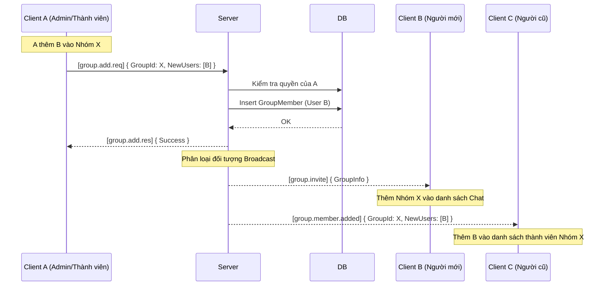

# UC-08 Mở rộng: Quản lý Nhóm Chat (Group Management)

## 1. Thiết kế Payload chung (`LanChat.Shared`)

### 1.1. Routing Keys
Bổ sung thêm các khóa định tuyến cho các hành động mới:
```csharp
public static partial class RoutingKeys
{
    // Tạo nhóm (Đã có)
    public const string GroupCreateReq  = "group.create.req";
    public const string GroupCreateRes  = "group.create.res";
    public const string GroupInvite     = "group.invite";     // Thông báo bị thêm vào nhóm

    // Lấy danh sách nhóm
    public const string GroupListReq    = "group.list.req";
    public const string GroupListRes    = "group.list.res";

    // Thêm thành viên
    public const string GroupAddReq     = "group.add.req";
    public const string GroupAddRes     = "group.add.res";
    public const string GroupMemberAdded = "group.member.added"; // Broadcast cho nhóm

    // Rời nhóm
    public const string GroupLeaveReq   = "group.leave.req";
    public const string GroupLeaveRes   = "group.leave.res";
    public const string GroupMemberLeft = "group.member.left";   // Broadcast cho nhóm
}
```

### 1.2. Cấu trúc DTO Cơ bản (Tái sử dụng)
*`GroupInfoDto` là xương sống cho giao diện Client.*
```csharp
public class GroupInfoDto {
    public Guid GroupId { get; set; }
    public string GroupName { get; set; }
    public string Creator { get; set; }
    public List<string> Members { get; set; } // Danh sách Usernames
}
```

---

## 2. Thiết kế Lớp chi tiết cho từng Tính năng

### 2.1. Tính năng: Lấy danh sách nhóm (Get Groups List)
*Hành động này nên được gọi ngay sau khi Client Đăng nhập thành công, bên cạnh việc lấy danh sách Online.*

**A. Payload:**
- **Req:** Trống (Chỉ cần `RoutingKey = GroupListReq`).
- **Res:** `GroupListResponsePayload { List<GroupInfoDto> Groups }`

**B. Server Handler (`ServerGroupListHandler`):**
1. Lấy `session.UserId` (Guid) hoặc dùng `session.Username` để truy vấn.
2. Query DB: Tìm tất cả `GroupId` trong bảng `GroupMembers` mà có `UserId` của người này.
3. Query tiếp bảng `ChatGroups` và `GroupMembers` (Include `Users`) để lấy đủ thông tin tạo list `GroupInfoDto`.
4. Gửi `GroupListRes` trả về Client.

**C. Client Handler:**
1. Nhận danh sách và đưa lên giao diện UI (Danh sách các phòng chat).

---

### 2.2. Tính năng: Thêm thành viên (Add Members)
*Chỉ cho phép người dùng đang ở trong nhóm được quyền thêm người khác vào.*

**A. Payload:**
- **Req:** `GroupAddRequestPayload { Guid GroupId, List<string> NewUsernames }`
- **Res:** `GroupAddResponsePayload { bool Success, string Message }`
- **Broadcast:** `GroupInvite` (cho người mới) và `GroupMemberAdded` (cho người cũ).

**B. Server Handler (`ServerGroupAddHandler`):**
1. **Bảo mật:** Truy vấn DB kiểm tra xem `session.UserId` có thực sự là thành viên của `GroupId` này không. Nếu không -> Từ chối.
2. Filter các `NewUsernames`: Loại bỏ những người đã có sẵn trong nhóm.
3. Nếu danh sách mới hợp lệ, tạo các bản ghi `GroupMember` mới và lưu vào DB.
4. **Phản hồi người thêm:** Gửi `GroupAddRes` (Thành công).
5. **Broadcast Lời mời (Cho người mới):** Lặp qua các user mới được thêm (nếu đang online), gửi gói `GroupInvite` (chứa `GroupInfoDto` mới nhất) để họ hiện UI.
6. **Broadcast Thông báo (Cho người cũ):** Lặp qua các user *đã ở trong nhóm từ trước* (nếu đang online), gửi gói `GroupMemberAdded` (chứa `GroupId` và `List<string> NewUsernames`) để Client update lại danh sách thành viên trên UI mà không cần tải lại toàn bộ nhóm.

---

### 2.3. Tính năng: Rời nhóm (Leave Group)

**A. Payload:**
- **Req:** `GroupLeaveRequestPayload { Guid GroupId }`
- **Res:** `GroupLeaveResponsePayload { bool Success, string Message }`
- **Broadcast:** `GroupMemberLeft { Guid GroupId, string Username }`

**B. Server Handler (`ServerGroupLeaveHandler`):**
1. Truy vấn DB bảng `GroupMembers`.
2. Xóa bản ghi `GroupMember` có `GroupId` và `UserId` tương ứng với người gửi.
3. `await dbContext.SaveChangesAsync()`.
4. **Logic nâng cao (Tùy chọn):** 
   - Nếu nhóm chỉ còn < 2 thành viên -> Có thể xóa luôn nhóm (Xóa `ChatGroup` và các `Message` liên quan).
   - Nếu không xóa nhóm -> Gửi `GroupLeaveRes` (Thành công) cho người rời.
5. **Broadcast:** Truy vấn lại danh sách thành viên còn lại trong nhóm, ai đang online thì gửi gói `GroupMemberLeft` để Client của họ xóa tên người rời khỏi giao diện hiển thị thành viên nhóm.

---

## 3. Sơ đồ Tuần tự: Flow Thêm Thành Viên

Sơ đồ này phức tạp vì nó tác động đến 3 nhóm đối tượng: Người thực hiện, Người mới, và Những người cũ trong nhóm.



---

## 4. Tích hợp với UC-05 (Gửi tin nhắn nhóm)
Việc quản lý thành viên trực tiếp trong Database giúp UC-05 không phải làm việc nặng nhọc.
Khi User A gửi tin nhắn đến `GroupId`:
- Server `ChatHandler` truy vấn DB lấy list `UserId` của `GroupId`.
- So khớp với `SessionManager` để biết ai online.
- Gửi tin nhắn.
